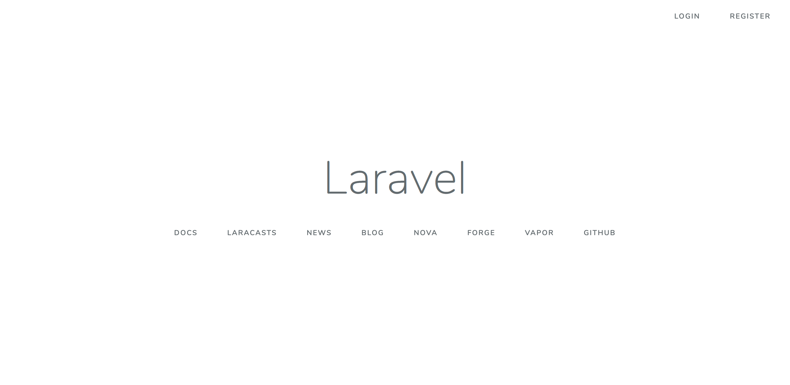
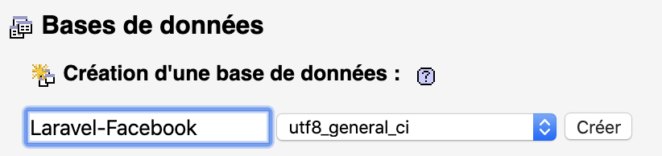
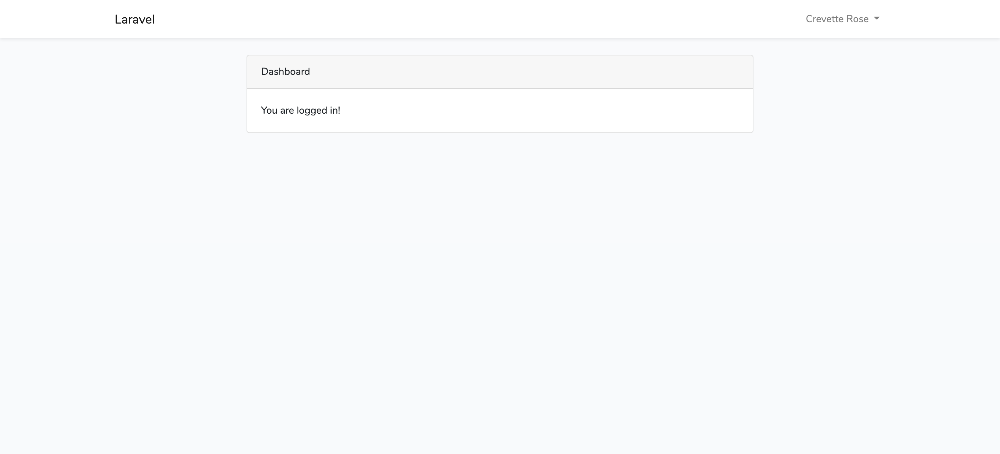
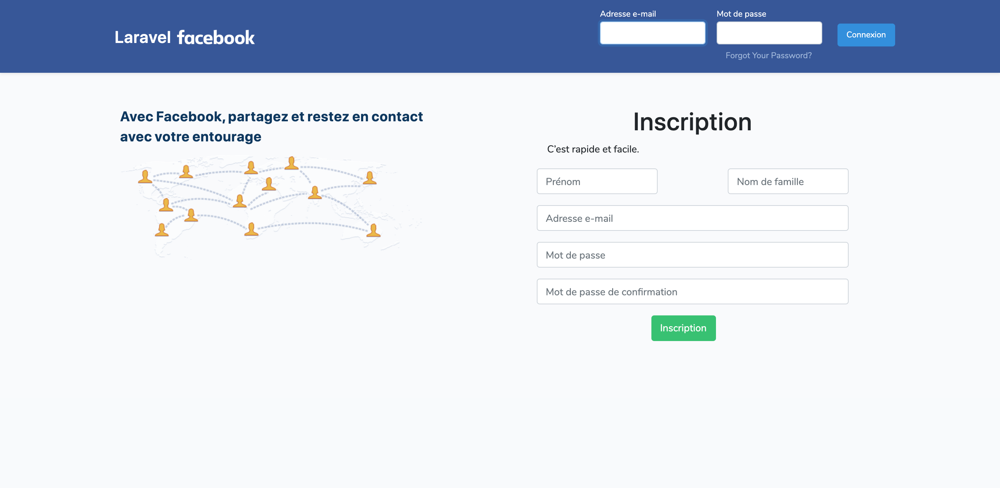

# Facebook Laravel

Créer un réseau social clone de Facebook en utilisant le framework PHP Laravel.

## I - Création du projet

Dans ce projet nous allons utilisés le CDN Bootstrap pour gérer le style de nos pages, ainsi que du jquery/javascript utilisé pour certains affichages.
Pour nos fichiers de vue coder en PHP, nous utilisons "Blade" natif dans les projets LARAVEL.

### A. En invite de commande / Côté code

Se placer dans le dossier ou vous souhaiter développer votre application via l'invite de commande.

1. Création du projet avec ou sans authentification (--auth)

```
laravel new Laravel-Facebook --auth
```

2. Intégration complète de Bootstrap au projet sans lien CDN
    - Installation du composant Bootstrap
        ```
        composer require laravel/ui --dev
        ```
    - Intégration du composants dans le projet
        ```
        php artisan ui bootstrap --auth
        ```
    - Mise à jour des fichiers crée avec l'intégration des class de Bootstrap
        ```
        npm install && npm run dev
        ```

Le projet doit maintenant être crée avec Bootstrap intégrer !!
Un nouveau dossier se crée avec le nom que vous lui avez donné ici "Laravel-Facebook".

-   Pour vérifier qu'il fonctionne, placer vous dans ce dossier nouvellement crée et taper la commande : `php artisan serve`<br>
    Le terminal vous renvoie l'url et le port sur lequel se lance votre projet
    ex par défault: **http://127.0.0.1:8000**
-   Rendez-vous sur cette adresse, vous devrez obtenir le visuel suivant :
    

### B. Coté Base de données

1. Créer une BDD vide.
   Lancer votre MAMP ou autres, et accéder à PHPMyAdmin.
    - Cliquer dans le menu de gauche sur "Nouvelle base de données", en haute taper le nom de votre BDD et cliquer sur **Créer**<br>
      Lui donner le nom du projet exemple "Laravel-Facebook"



-   Ouvrir se dossier via votre éditeur de code, pour moi se sera Visual Studio Code.
-   Pour connecter la BDD à notre projet, il faut modifier le fichier **_".env"_** situé à la racine du projet.

-   Faire correspondre les données suivantes entre MySQL et votre projet, vous trouverez ces informations dans la configuration de votre MAMP

    ```
    DB_CONNECTION=mysql
    DB_HOST=localhost;
    DB_PORT=8889
    DB_DATABASE=Laravel-Facebook
    DB_USERNAME=root
    DB_PASSWORD=root
    ```

-   Modifier la ligne suivante pour les utilisateurs de mamps
    `DB_HOST=localhost;unix_socket=/Applications/MAMP/tmp/mysql/mysql.sock`

Votre projet dois désormais être connecter à la base de données, vous pourrez le constatez une fois que vous aurez effectué des migrations dans votre projet.
`php artisan migrate`<br>
Ensuite essayer en créant des utilisateurs en lançant le serveur car sur ce projet l'authentification de base de laravel est installé avec le projet et donc fonctionnel :
`php artisan serve`<br>

Si dans votre BDD, vous pouvez voir les utilisateurs crée, c'est que la connexion est correctement effectué.

**_`Attention à chaque modification du fichier ".env", il faut relancer le serveur !`_**

### C. Interface obtenu

-   Page d'accueil :
    

-   Page de "Register"
    

-   Page de "Login"
    

-   Page une fois connecté
    

## II - Création d'un repo git

Gestionnaire de version de notre projet, pour garantir l'optimisation et la sauvegarde du projet.

1. Crée un nouveau référentiel sur la ligne de commande :

    ```
    git init
    ```

2. Pousser un référentiel existant depuis la ligne de commande :

```
   git remote add origin https://lien_de_votre_projet.git
   git push -u origin master
```

3. Faire un premier commit
4. Push son projet.

## III - Modification de la page d'accueil

Transformation de la page d'accueil de LARAVEL en une page d'accueil similaire à celle de Facebook.

1. Pour cela, il faut modifier le fichier **"welcome.blade.php"**<br>
   Il se situe dans le dossier ./ressources/views

<details>
<summary>
Code de la page welcome.blade.php
</summary>

```php
<!DOCTYPE html>
<html lang="{{ str_replace('_', '-', app()->getLocale()) }}">

<head>
    <meta charset="utf-8">
    <meta name="viewport" content="width=device-width, initial-scale=1">

    <title>Laravel Facebook</title>

    <!-- Fonts -->
    <link href="https://fonts.googleapis.com/css?family=Nunito:200,600" rel="stylesheet">

    <!-- Styles -->
    <link href="{{ asset('css/app.css') }}" rel="stylesheet">
    <style>
        .left,
        .right {
            width: 50%;
            justify-content: center;
        }

    </style>

</head>

<body>
    <nav class="navbar navbar-expand-md navbar-light shadow-sm" style="background:#385898;">
        <div class="container">
            <a style="font-size:1.5rem;" class="navbar-brand text-white" href="{{ url('/') }}">
                {{ config('app.name', 'Laravel') }}
            </a>
            <button class="navbar-toggler" type="button" data-toggle="collapse" data-target="#navbarSupportedContent"
                aria-controls="navbarSupportedContent" aria-expanded="false" aria-label="{{ __('Toggle navigation') }}">
                <span class="navbar-toggler-icon"></span>
            </button>

            <div class="collapse navbar-collapse" id="navbarSupportedContent">
                <!-- Left Side Of Navbar -->
                <ul class="navbar-nav mr-auto">

                </ul>

                <!-- Right Side Of Navbar -->
                <ul class="navbar-nav ml-auto">
                    <!-- Authentication Links -->
                    <form method="POST" action="{{ route('login') }}" class="d-flex">
                        @csrf

                        <div class="form-group px-2 m-0">
                            <label style="font-size:12px;" for="email"
                                class="text-md-right text-white mb-0">{{ __('Adresse e-mail') }}</label>

                            <div class="">
                                <input style="font-size:12px;" id="email" type="email"
                                    class="form-control @error('email') is-invalid @enderror" name="email"
                                    value="{{ old('email') }}" required autocomplete="email" autofocus>

                                @error('email')
                                <span class="invalid-feedback" role="alert">
                                    <strong>{{ $message }}</strong>
                                </span>
                                @enderror
                            </div>
                        </div>

                        <div class="form-group px-2 m-0">
                            <label style="font-size:12px;" for="password"
                                class="text-md-right text-white mb-0">{{ __('Mot de passe') }}</label>

                            <div class="">
                                <input style="font-size:12px;" id="password" type="password"
                                    class="form-control @error('password') is-invalid @enderror" name="password"
                                    required autocomplete="current-password">

                                @error('password')
                                <span class="invalid-feedback" role="alert">
                                    <strong>{{ $message }}</strong>
                                </span>
                                @enderror
                                @if (Route::has('password.request'))
                                <a style="color:#9cb4d8; font-size:12px;" class="btn btn-link"
                                    href="{{ route('password.request') }}">
                                    {{ __('Forgot Your Password?') }}
                                </a>
                                @endif
                            </div>
                        </div>

                        <div class="form-group m-auto">
                            <div class="offset-md-2 pb-1">
                                <button style="font-size:12px;" type="submit" class="btn btn-primary">
                                    {{ __('Connexion') }}
                                </button>
                            </div>
                        </div>
                    </form>

                </ul>
            </div>
        </div>
    </nav>

    <div class="container d-flex flex-nowrap">
        <div class="left m-2">
            <H1
                style="color:#0e385f; font-size: 20px; font-weight: bold; line-height: 29px;
    margin-top: 40px; width: 450px; word-spacing: -1px; font-family: system-ui, -apple-system, BlinkMacSystemFont, '.SFNSText-Regular', sans-serif;">
                Avec Facebook, partagez et restez en contact avec votre entourage</H1>
            <div>
                
            </div>
        </div>
        <div class="row right d-flex justify-content-center m-2 ">

            <H1 class="row"
                style="  margin-top: 40px; font-family: system-ui, -apple-system, BlinkMacSystemFont, '.SFNSText-Regular', sans-serif;">
                {{ __('Inscription') }}</H1>

            <div class="col-md-10">
                <p>C’est rapide et facile.</p>
                <form method="POST" action="{{ route('register') }}">
                    @csrf
                    <div class="d-flex justify-content-between">
                        <!-- Champ Prénom -->
                        <div class="form-group row mr-5">
                            <input id="firstname" type="text"
                                class="form-control @error('firstname') is-invalid @enderror" name="firstname"
                                value="{{ old('firstname') }}" placeholder="Prénom" required autocomplete="firstname"
                                autofocus>

                            @error('firstname')
                            <span class="invalid-feedback" role="alert">
                                <strong>{{ $message }}</strong>
                            </span>
                            @enderror
                        </div>

                        <!-- Champ Nom -->
                        <div class="form-group row">
                            <input id="name" type="text" class="form-control @error('name') is-invalid @enderror"
                                name="name" value="{{ old('name') }}" placeholder="Nom de famille" required
                                autocomplete="name" autofocus>

                            @error('name')
                            <span class="invalid-feedback" role="alert">
                                <strong>{{ $message }}</strong>
                            </span>
                            @enderror
                        </div>
                    </div>

                    <!-- Champ Mail -->
                    <div class="form-group row">
                        <input id="email" type="email" class="form-control @error('email') is-invalid @enderror"
                            name="email" value="{{ old('email') }}" placeholder="Adresse e-mail" required
                            autocomplete="email">

                        @error('email')
                        <span class="invalid-feedback" role="alert">
                            <strong>{{ $message }}</strong>
                        </span>
                        @enderror
                    </div>

                    <!-- Champ Mot de passe -->
                    <div class="form-group row">
                        <input id="password" type="password"
                            class="form-control @error('password') is-invalid @enderror" name="password"
                            placeholder="Mot de passe" required autocomplete="new-password">

                        @error('password')
                        <span class="invalid-feedback" role="alert">
                            <strong>{{ $message }}</strong>
                        </span>
                        @enderror
                    </div>

                    <!-- Champ Mot de passe de confirmation -->
                    <div class="form-group row">
                        <input id="password-confirm" type="password" class="form-control" name="password_confirmation"
                            placeholder="Mot de passe de confirmation" required autocomplete="new-password">
                    </div>

                    <!-- Bouton d'envoi du formulaire d'inscription -->
                    <div class="form-group row mb-0">
                        <div class="col-md-6 offset-md-4">
                            <button type="submit" class="btn btn-primary btn-success">
                                {{ __('Inscription') }}
                            </button>
                        </div>
                    </div>
                </form>
            </div>
        </div>
    </div>

</body>

</html>
```

</details>

<details>
<summary>
Visuel de la page d'accueil
</summary>



</details>

## IV - Ajout du champ prénom

Maintenant que notre code et notre visuel est prêt pour faire fonctionner celui-ci nous avons ajouter un champ prénom qu'il faut également ajouter dans notre BDD.

1. Aller dans le fichier : annnée_mois_date_000000_create_users_table.php<br>
   Qui se situe dans le dossier /database/migrations/

-   Ajouter la ligne concernant le prénom : `$table->string('firstname');`

2. Dans le fichier : User.php<br>
   Qui se situe dans le dossier /app/

-   Ajouter la propriété "firstname" :

```php
protected $fillable = [
      'firstname','name', 'email', 'password',
  ];

```

3. Dans le fichier de création des Users soit ici "RegisterController"<br>
   Qui se situe dans /app/Http/Controllers/Auth/

-   Ajouter la ligne concernant le prénom dans la fonction validator et User::create comme suit :

```php
 protected function validator(array $data)
    {
        return Validator::make($data, [
            'firstname' => ['required', 'string', 'max:255'],
            'name' => ['required', 'string', 'max:255'],
            'email' => ['required', 'string', 'email', 'max:255', 'unique:users'],
            'password' => ['required', 'string', 'min:8', 'confirmed'],
        ]);
    }

     protected function create(array $data)
    {
        return User::create([
            'firstname' => $data['firstname'],
            'name' => $data['name'],
            'email' => $data['email'],
            'password' => Hash::make($data['password']),
        ]);
    }
```

4. Lancer la migration pour que les modifications prennent effet :
   `php artisan migrate`

-   Si vous aviez déjà des utilisateurs de crée, votre application plantera car il n'avait pas de prénom.
    Deux solutions: Ajouter le prénom directement en BDD ou supprimer vos utilisateurs en lançant la commande `php artisan migrate:refresh`

5. Tester une inscription utilisateurs, puis une déconnexion, et une connexion via l'utilisateur crée.

## V - Ajout du champ avatar

Nous aurons également besoin d'un avatar pour la suite de notre profil. Nous allons donc ajouter ce champs dans la BDD comme précédemment pour le prénom.

1. Aller dans le fichier : annnée_mois_date_000000_create_users_table.php<br>
   Ce champ est null à la création du compte<br>
   Qui se situe dans le dossier /database/migrations/

-   Ajouter la ligne concernant l'avatar : `$table->string('avatar')->nullable();`

2. Dans le fichier : User.php<br>
   Qui se situe dans le dossier /app/

-   Ajouter la propriété "avatar" et une fonction pour le récuperer :

```php
 protected $fillable = [
        'avatar','firstname','name', 'email', 'password',
    ];

  public function getAvatar() {
  if (!$this->avatar) {
              return '/img/avatar-vide.png';
          }
          return $this->avatar;
  }

```

3. Dans le fichier de création des Users soit ici "RegisterController"<br>
   Qui se situe dans /app/Http/Controllers/Auth/

-   Ajouter la ligne concernant le prénom dans la fonction validator et User::create comme suit :

```php
use Intervention\Image\Facades\Image;

 protected function validator(array $data)
    {
        return Validator::make($data, [
            'firstname' => ['required', 'string', 'max:255'],
            'name' => ['required', 'string', 'max:255'],
            'email' => ['required', 'string', 'email', 'max:255', 'unique:users'],
            'password' => ['required', 'string', 'min:8', 'confirmed'],
        ]);
    }

      protected function create(array $data)
    {
        $request = app('request');

        $path = null;

        if($request->hasFile('avatar')){
            $avatar = $request->file('avatar');
            $filename = time() . '.' . $avatar->getClientOriginalExtension();
            $path = '/uploads/avatars/' . $filename;
            Image::make($avatar)->resize(100, 100)->save(public_path($path));
        }

        return User::create([
            'avatar' => $path,
            'firstname' => $data['firstname'],
            'name' => $data['name'],
            'email' => $data['email'],
            'password' => Hash::make($data['password']),
        ]);
    }
```

### Ajout de la bibliothèque "Intervention/image"

4. Pour l'utilisation des avatars, nous avons besoin d'importer une bibliothèque :
   `composer require intervention/image`

5. Dans le fichier "app.php" qui se situe dans /config/

-   Ajouter dans les "providers" la ligne suivante :

```php
 Intervention\Image\ImageServiceProvider::class
```

-   Ajouter dans les "aliases" la ligne suivante :

```php
  'Image' => Intervention\Image\Facades\Image::class
```

6. Lancer la migration pour que les modifications prennent effet :
   `php artisan migrate`
    - Si celui-ci affiche "Nothing to migrate".<br>
      Procéder comme suit, cela permet de revenir une modification en arrière<br>
      `php artisan migrate:rollback`<br>
      et relancer la migration<br>
      `php artisan migrate`

-   Si vous avez coupez votre serveur pour installer la bibliothèque d'image, n'oubliez pas de le relancer avec `php artisan serve`.

7. Tester une inscription utilisateur, puis une déconnexion, et une connexion via l'utilisateur crée.
   Si cela fonctionne toujours mais que vous ne voyez pas l'avatar cela est normal car nous ne l'avons pas encore ajouté à nos vues.

## VI - Gestion des erreurs en français

Pour créer un projet avec des messages d'erreur en français, cela est possible grâce à plusieurs méthodes :

-   Voir le lien suivant : [Apprendre à gérer les messages d'erreur](https://www.apprendre-laravel.fr/laraguide/2017-11-18-personnaliser-nos-messages-d-erreur)
-   Plusieurs langues disponibles sur le ".zip" suivant : [docs/Laravel-lang-master.zip](docs/Laravel-lang-master.zip)
-   Ou en ajoutant le dossier "fr" dans le répertoire "ressources/lang/".

Il faut ensuite modifier le fichier "app.php" situé "app/config" en modifiant les lignes suivantes par "fr" au lieu de "en" :

```php
    'locale' => 'fr',
    'fallback_locale' => 'fr',
    'faker_locale' => 'fr_FR',
```

Vous pouvez désormais tester vos formulaires pour vérifier l'application des messages en français

## VII - Barre de navigation et gestion du menu après connexion

### A. Modification de la barre de navigation

La barre de navigation est native à la connexion de LARAVEL, elle se trouve dans /ressources/views/layouts/<br>
Dans le fichier "app.blade.php"

1. Ajout de la couleur de fond correspondant à celle de Facebook

```php
<nav class="navbar navbar-expand-md navbar-light shadow-sm" style="background:#385898;">
```

Implémenter simplement le style en ligne précédent sur la "nav" existante

2. Ajout du logo de Facebook

```php
   <a class="navbar-brand text-white" href="{{ url('/') }}">
      {{ config('app.name', 'Laravel') }}
      
    </a>
```

Ajout de la class "text-write" pour afficher le texte en blanc via Bootstrap.<br>
Implémentation de la balise image avec intégration du logo de Facebook en mode image.

<p>
  Pour ce qui est du style du texte Laravel cela à été modifier dans le fichier "app.css" qui se situe dans /public/css/.
</p>

```css
.navbar-brand {
    display: inline-block;
    padding-top: 0.32rem;
    padding-bottom: 0.32rem;
    margin-right: 1rem;
    font-size: 1.125rem;
    line-height: inherit;
    white-space: nowrap;
    font-family: system-ui, -apple-system, BlinkMacSystemFont, ".SFNSText-Regular",
        sans-serif;
    font-weight: 600;
}
```

Ajout des deux dernières lignes pour la typographie.

3. Ajout de l'avatar & changement nom par prénom & changement couleur texte et puce.

```php
<li class="nav-item dropdown d-flex">
  <a href="#" class="text-decoration-none text-white m-auto d-flex">
    <div class="mr-2" style="width:40px;">getAvatar()}}" width="100%" height="100%">
    </div>
    <p class="my-auto"
        style="font-family: system-ui, -apple-system, BlinkMacSystemFont, '.SFNSText-Regular', sans-serif; font-weight:bold;">
        {{ Auth::user()->firstname }}
    </p>
  </a>
  <a class="nav-link dropdown-toggle" href="#" role="button" data-toggle="dropdown"
      aria-haspopup="true" aria-expanded="false" v-pre>
      <span class="caret" style="color:#1a2a47;"></span>
  </a>
```

### B. Modification du menu et sous-menu de la barre de navigation

1. Déplacement et ajout des sous-menu profil et compte

```php
      <div class="dropdown-menu dropdown-menu-right mt-2" aria-labelledby="navbarDropdown">

        <a class="dropdown-item" href="#">Profil</a>
        <a class="dropdown-item" href="#">Compte</a>
         <div class="m-2"><hr></div>
        <a class="dropdown-item" href="{{ route('logout') }}" onclick="event.preventDefault();
                              document.getElementById('logout-form').submit();">
            {{ __('Se déconnecter') }}
        </a>

        <form id="logout-form" action="{{ route('logout') }}" method="POST"
            style="display: none;">
            @csrf
        </form>
    </div>
</li>
```

2. Ajout au hover du bleu foncé dans le css et changement de couleur en blanc

```css
.dropdown-item:hover,
.dropdown-item:focus {
    color: #fff;
    text-decoration: none;
    background-color: #385898;
}
```

Votre barre de navigation est désormais prête et ressemblante à celle de Facebook.

## VIII - Création de la page "Compte"

Cette page permettra à l'utilisateur de gérer son compte, c'est-à-dire de pouvoir y modifier les informations le concernant ainsi que de pouvoir supprimer son compte.

### A. Création de la vue (views)

-   La vue portera le nom suivant : account.blade.php
    La page fera appel à la même barre de navigation que le reste des pages déjà crée, avec le même style.
    Pour cela, il suffit de récupérer le template qui s'est crée en même temps que notre projet c'est-à-dire le fichier "app.blade.php" qui se situe dans le dossier /layouts.

Nous appelons donc dans nos fichiers de vue le template permettant de récupérer le même stlye sur chaque page. Cela évite également la répétition du code en ce qui concerne le HTML, le HEAD, le BODY et le MAIN grace au balisage suivantes :

-   Appel du template avec HTML, HEAD, BODY : `@extends('layouts.app')`
-   Appel du conteneur MAIN : `@section('content')`

\*\* Cette balise est bien sûre à fermer en fin de page par `@endsection`, tout comme pour annoncer la fermeture du MAIN.

-   Créer un fichier appelé "account.blade.php" dans le dossier "ressources/views/auth" et y appelé les balises nécéssaires.

```php
@extends('layouts.app')
@section('content')
<h1>Page Compte</h1>
@endsection
```

### B. Création du "Controller"

Il permet de gérer les données de la vue

    - Taper la commande suivante : `php artisan make:controller AccountController -r`
      On demande à LARAVEL de créer un controlleur pour gérer les données de la vue, le "-r" permet de créer ce fichier avec les ressources précharger (function index(), voir(), créer(), modifier(), supprimer() etc...)
    - Le controller que vous venez de créer avec le nom "AccountController" se situe dans le dossier /app/Http/Controllers.

    * Ajouter les fonctions suivantes pour afficher les données de la page :

    ```php
      public function show()
    {
        return view('/auth/account', ['user' => Auth::user()]);
    }

    public function account()
    {
        return view('/auth/account', array('user' => Auth::user()));
    }
    ```

### C. Création de la "Route" dans "web.php"

Elle permet l'accès à l'url, ce fichier se situe dans le dossier "/routes"

-   Pour créer la route, ajouter cette ligne :
    ```php
    //Route de vision du compte
    Route::get('account', 'AccountController@show')->middleware('auth')->name('account');
    ```
