#  

Créer un réseau social clone de Facebook en utilisant le framework PHP Laravel.

## Tutorial Étapes

-   **I. [Création du projet](docs/creation-projet.md)** > _Projet initial vide_

-   **II. [Création d'un repo git](docs/creation-repo-git.md)** > _Gestion du versionning de fichier_

-   **III. [Page de connexion](docs/page-connexion.md)** > _Modification de page d'accueil LARAVEL en page de connexion pour Facebook_

-   **IV. [Champs "prénom" et "avatar"](docs/firstname-and-avatar.md)** > _Ajout du champ prénom à notre formulaire d'inscription, et ajout de l'avatar pour l'intégration futur de celui-ci._

-   **V. [Intégration de la Gestion des erreurs en français](docs/gestion-erreur-fr.md)** > _Tester vos formulaires en faisant des erreurs pour vérifier la bonne application._

-   **VI. [Barre de navigation](docs/barre-navigation.md)** > _Modification de l'apparence de la barre de navigation de LARAVEL après connexion, par une barre de navigation ressemblante à celle de Facebook, ainsi qu'un sous-menu correspondant._

-   **VII. [Page Compte](docs/page-compte.md)** > _Création de la page de gestion du compte avec le controller et les routes associés "AccountController" (modification données du compte, ajout d'un nom d'utilisateur \[migration], suppression avatar/compte)._

-   **VIII. [Page Profil](docs/page-profil.md)** > _Création de la page profil avec le controller et les routes associés "ProfilController", possibilité de modifier son avatar et sa photo de couverture_

-   **IX. [Création des posts](docs/posts.md)** > _Création des posts avec la migration, les ressources du controller, le model et les routes associés "PostController" (Ajout/Vision/Suppression de ses propres posts sur son fil d'actualité (home)._

-   **X. [Voir ses posts sur son profil](docs/page-profil-posts.md)** > _Possibilité de voir ses propres posts sur son profil et de les supprimer également "ProfilController". (Gestion de la vue et du controller)._

-   **XI. [Demandes d'amis](docs/amis.md)** > _Création de la demande d'amitié avec la migration, le model et la modification du controller "ProfilController" qui gérera nos demandes. (Ajouter un amis, Accepter ou Refuser une demande d'amis, Suppression d'un amis)._

-   **XII. [J'aime/J'aime pas](docs/like-unlike.md)** > _Aimer un post, afficher le compteur et ne plus aimer un post, mise à jour du compteur._

## Grilles des Vues

|                                                                                                                                       |                                                                                                                                      |                                                                                                                                |
| :-----------------------------------------------------------------------------------------------------------------------------------: | :----------------------------------------------------------------------------------------------------------------------------------: | :----------------------------------------------------------------------------------------------------------------------------: |
|                            Page de base de LARAVEL                           |                    Création de BDD                    |                  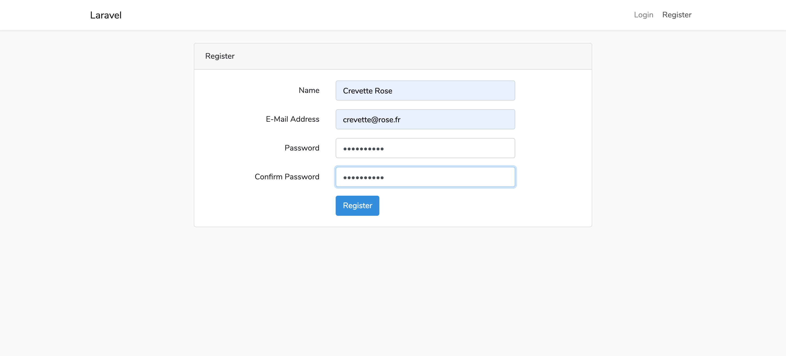 Page d'inscription LARAVEL                  |
|                         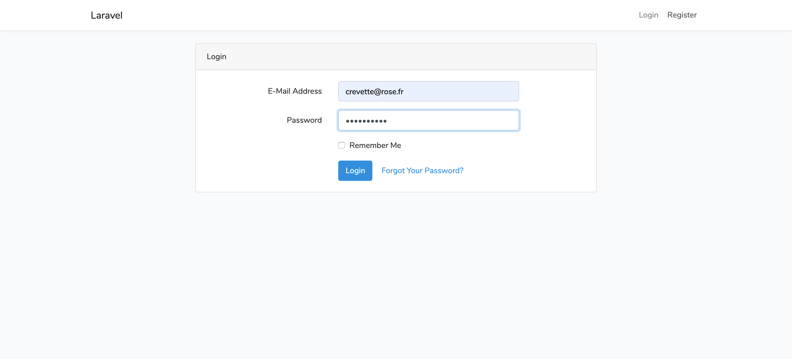 Page de connexion LARAVEL                         |                      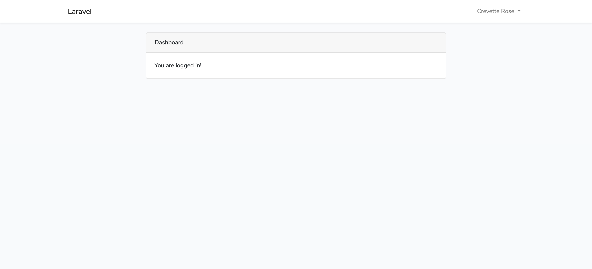 Page d'accueil LARAVEL                      |                      Logo Laravel Facebook                     |
|                             Logo réduit LFB blanc                            |                        Logo réduit LFB bleu                        |           Logo réduit au couleur LFB          |
|                     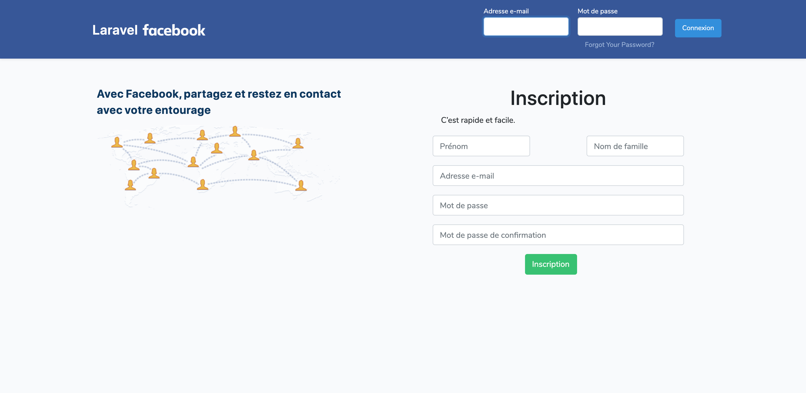 Page de connexion/inscription FBL                     |                Barre de navigation FBL                |                     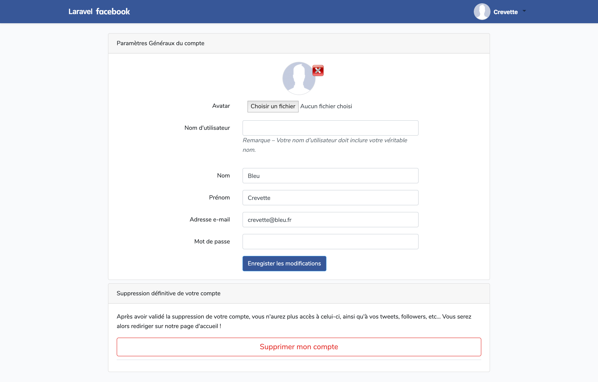 Page Compte FBL                      |
|               Page profil initial              |               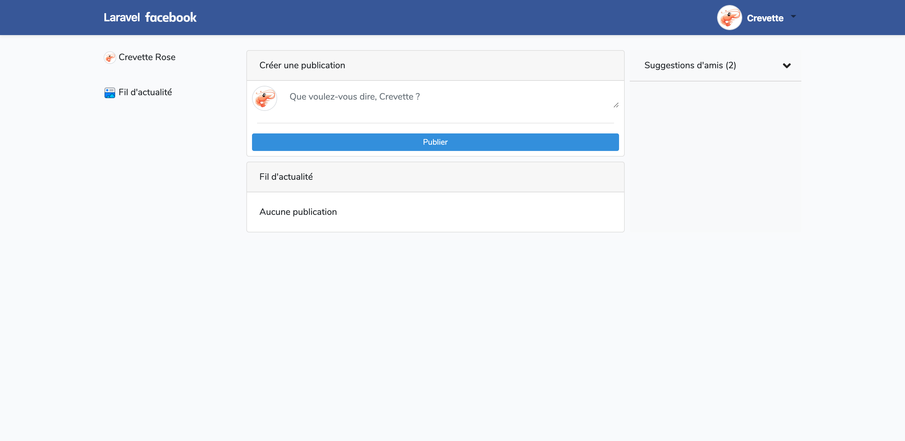 Page Home (accueil) - Étape 1 initial                | 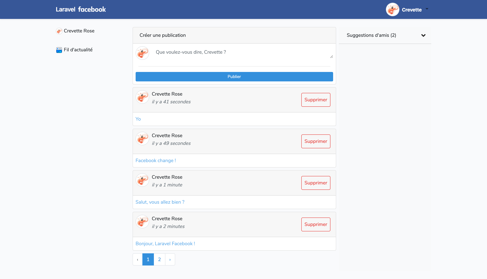 Page Home - Étape 2 avec publication |
|  Page Home - Étape 2 suppression publication |                      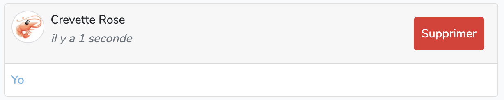 Page Home - Étape 3 post                      |                 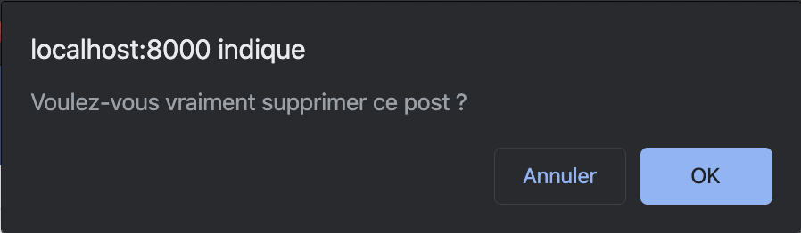 Page Home - Étape 3 alert                  |
|               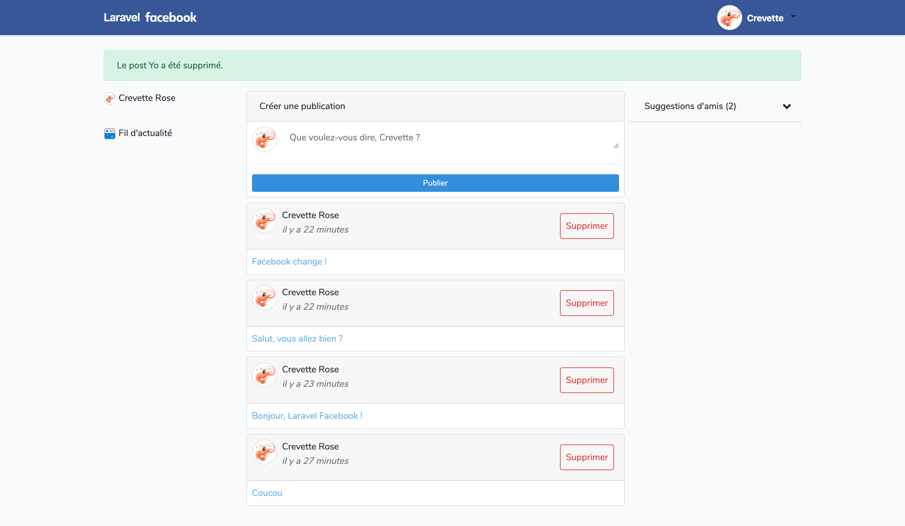 Page Home - Étape 3 supprimé                |          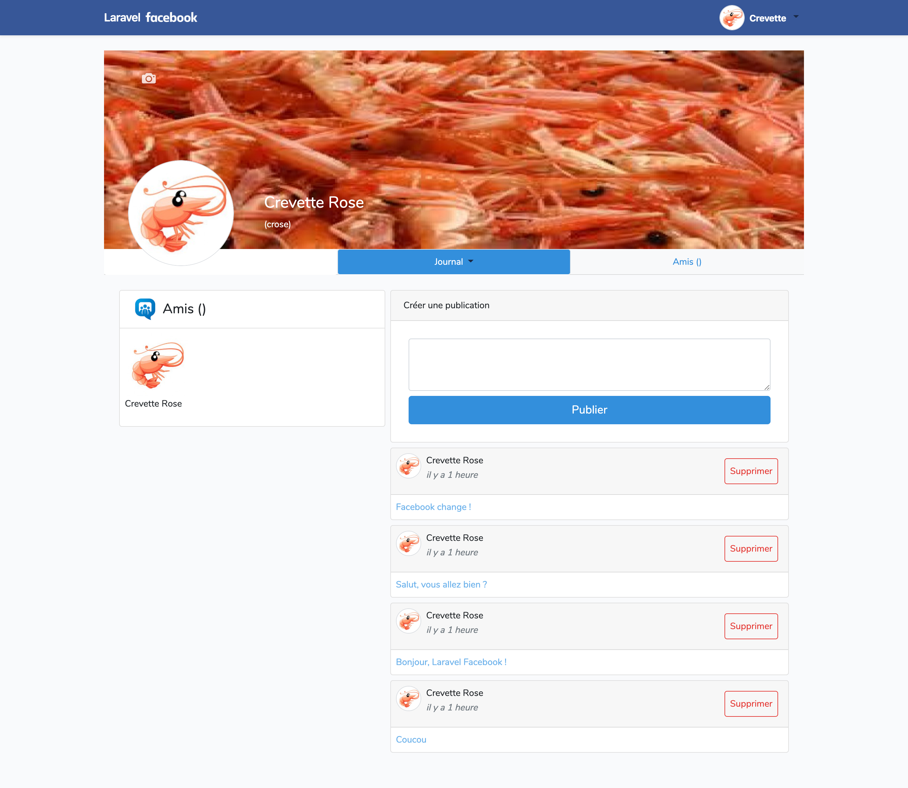 Page profil - Journal avec posts          |     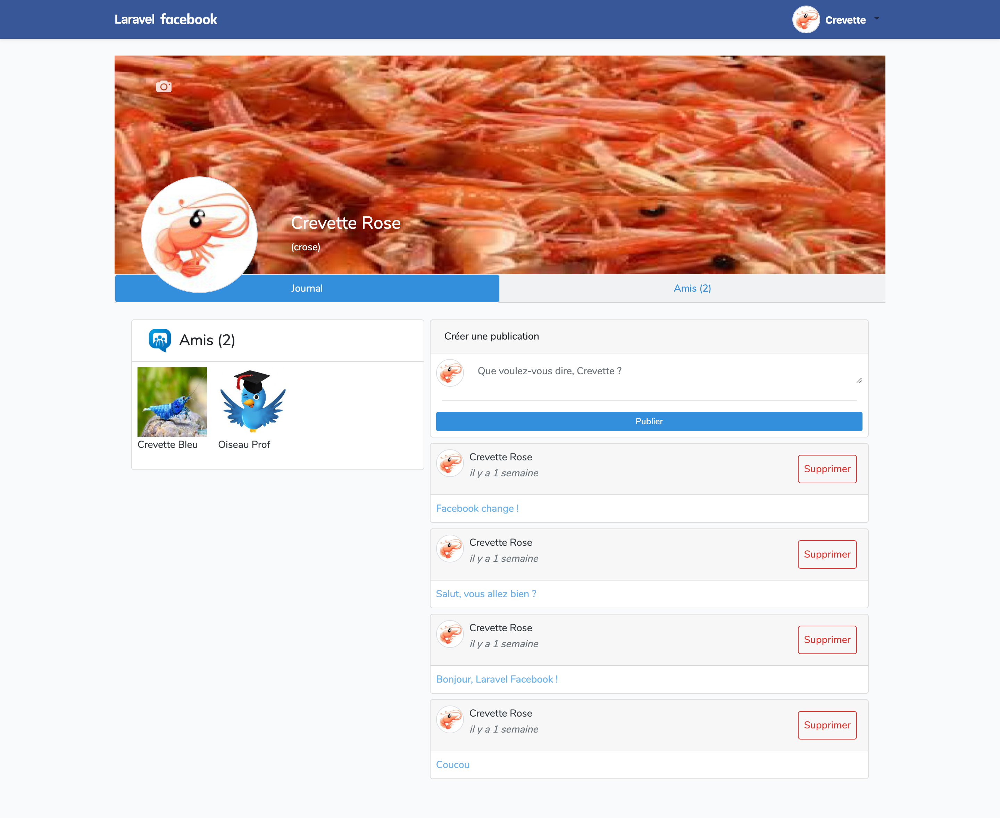 Page profil - Journal avec amis      |
|    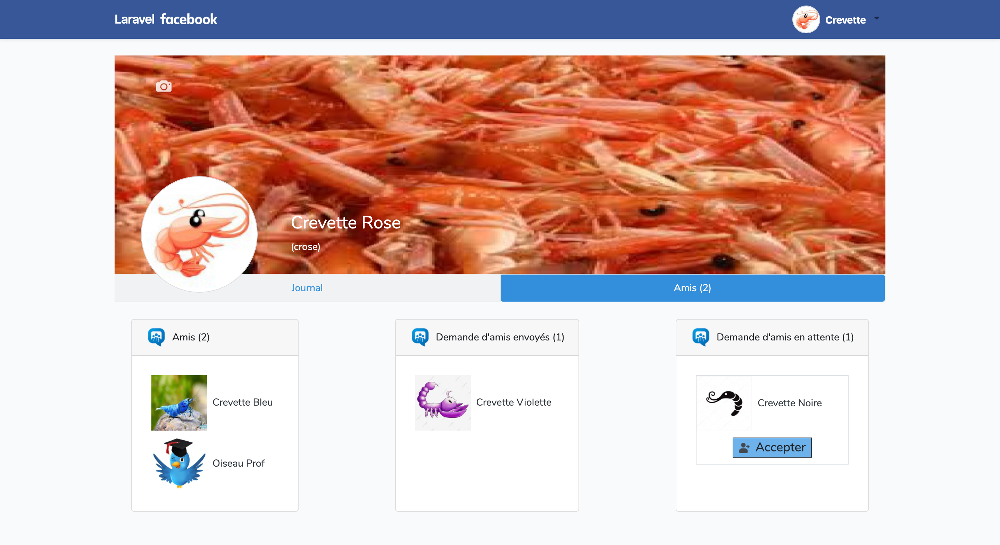 Page profil - Amis gestion utilisateur connecté    | 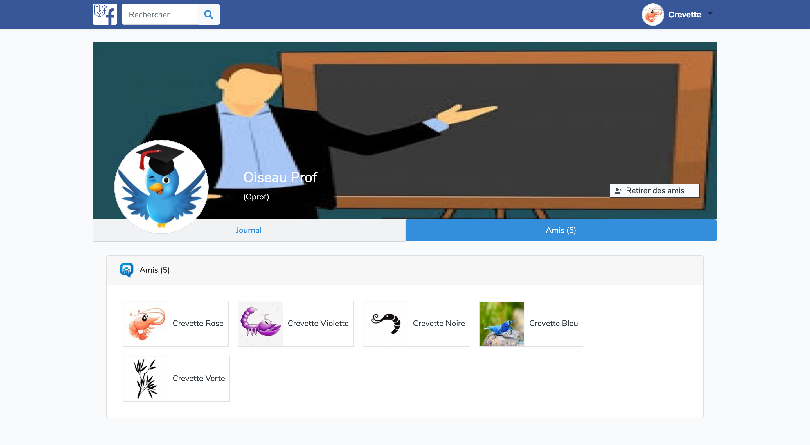 Page profil - Amis vision utilisateur pas connecté |                                                               ?                                                                |
