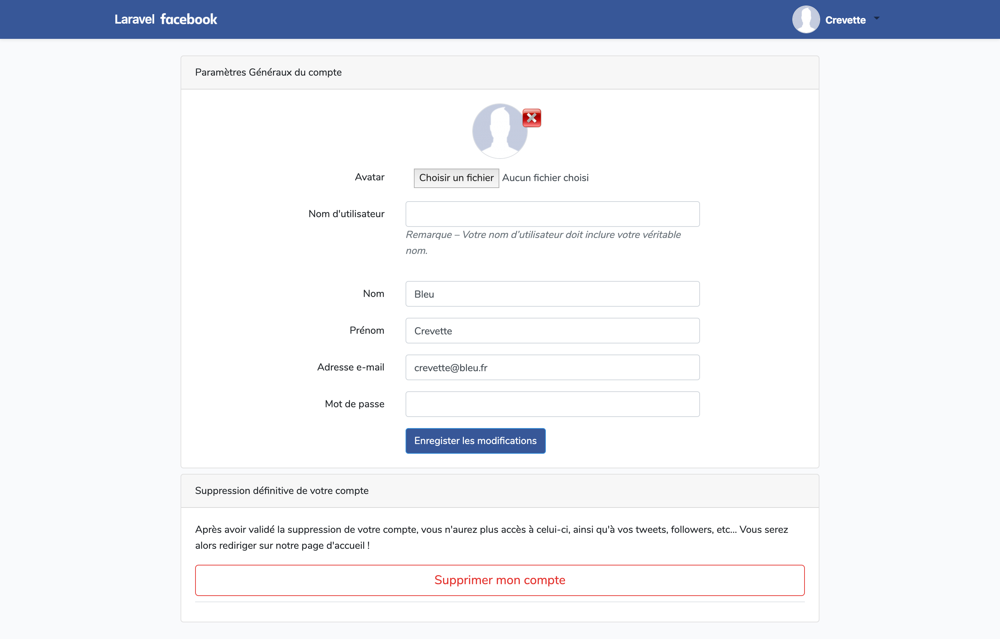
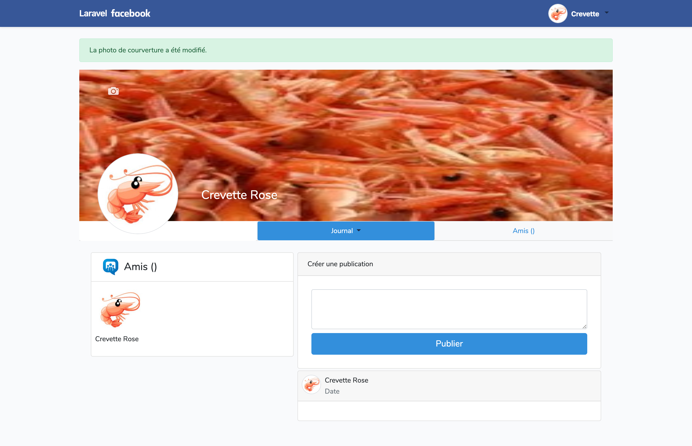

# 

Créer un réseau social clone de Facebook en utilisant le framework PHP Laravel.

## Tutorial Étapes

-   **I. [Création du projet](docs/creation-projet.md)** > _Projet initial vide_

-   **II. [Création d'un repo git](docs/creation-repo-git.md)** > _Gestion du versionning de fichier_

-   **III. [Page de connexion](docs/page-connexion.md)** > _Modification de page d'accueil LARAVEL en page de connexion pour Facebook_

-   **IV. [Champs "prénom" et "avatar"](docs/firstname-and-avatar.md)** > _Ajout du champ prénom à notre formulaire d'inscription, et ajout de l'avatar pour l'intégration futur de celui-ci._

-   **V. [Intégration de la Gestion des erreurs en français](docs/gestion-erreur-fr.md)** > _Tester vos formulaires en faisant des erreurs pour vérifier la bonne application._

-   **VI. [Barre de navigation](docs/barre-navigation.md)** > _Modification de l'apparence de la barre de navigation de LARAVEL après connexion, par une barre de navigation ressemblante à celle de Facebook, ainsi qu'un sous-menu correspondant._

-   **VII. [Page Compte](docs/page-compte.md)** > _Création de la page de gestion du compte avec le controller et les routes associés "AccountController" (modification données du compte, ajout d'un nom d'utilisateur \[migration], suppression avatar/compte)._

-   **VIII. [Page Profil](docs/page-profil.md)** > _Création de la page profil avec le controller et les routes associés "ProfilController", possibilité de modifier son avatar et son image de fond_

-   **IX. [Création des posts](docs/posts.md)** > _Création des posts / commentaires avec la migration, les ressources du controller, le model et les routes associés "PostController" (Ajout/Vision/Suppression de ses propres posts sur son fil d'actualité (home) et sur son profil dans le journal + Visualisation des posts de mes ami(e)s sur le fil d'actualité)._

## Grilles des Vues

|                                                                                               |                                                                                    |                                                                                |
| :-------------------------------------------------------------------------------------------: | :--------------------------------------------------------------------------------: | :----------------------------------------------------------------------------: |
|                Page de base de LARAVEL               |   Création de BDD   |   Page d'inscription LARAVEL  |
|              Page de connexion LARAVEL             |      Page d'accueil LARAVEL     |  Logo Laravel Facebook |
|          Page de connexion/inscription FBL         |  Barre de navigation FBL |      Page Compte FBL      |
|  Page profil - étape 1 |                                         ?                                          |                                       ?                                        |
