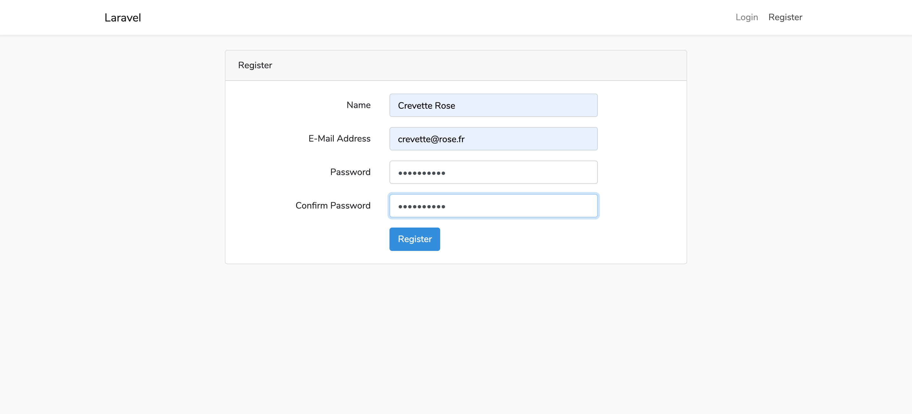
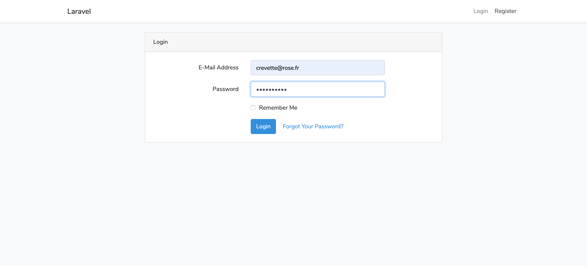

# Facebook Laravel

Application de page unique de type Facebook avec Laravel.

## I - Création du projet

Dans ce projet nous allons utilisés le CDN Bootstrap pour gérer le style de nos pages, ainsi que du jquery/javascript utilisé pour certains affichages.
Pour nos fichiers de vue coder en PHP, nous utilisons "Blade" natif dans les projets LARAVEL.

### A. En invite de commande / Côté Serveur

Se placer dans le dossier ou vous souhaiter développer votre application via l'invite de commande.

1. Création du projet avec ou sans authentification (--auth)

```
laravel new Laravel-Facebook --auth
```

2. Intégration complète de Bootstrap au projet sans lien CDN
    - Installation du composant Bootstrap
        ```
        composer require laravel/ui --dev
        ```
    - Intégration du composants dans le projet
        ```
        php artisan ui bootstrap --auth
        ```
    - Mise à jour des fichiers crée avec l'intégration des class de Bootstrap
        ```
        npm install && npm run dev
        ```

Le projet doit maintenant être crée avec Bootstrap intégrer !!
Un nouveau dossier se crée avec le nom que vous lui avez donné ici "Laravel-Facebook".

-   Pour vérifier qu'il fonctionne, placer vous dans ce dossier nouvellement crée et taper la commande : `php artisan serve`<br>
    Le terminal vous renvoie l'url et le port sur lequel se lance votre projet
    ex par défault: **http://127.0.0.1:8000**
-   Rendez-vous sur cette adresse, vous devrez obtenir le visuel suivant :
    

2. Créer une BDD vide.
   Lancer votre MAMP ou autres, et accéder à PHPMyAdmin.
    - Cliquer dans le menu de gauche sur "Nouvelle base de données", en haute taper le nom de votre BDD et cliquer sur **Créer**<br>
      Lui donner le nom du projet exemple "Laravel-Facebook"


-   Ouvrir se dossier via votre éditeur de code, pour moi se sera Visual Studio Code.
-   Pour connecter la BDD à notre projet, il faut modifier le fichier **_".env"_** situé à la racine du projet.

-   Faire correspondre les données suivantes entre MySQL et votre projet, vous trouverez ces informations dans la configuration de votre MAMP

    ```
    DB_CONNECTION=mysql
    DB_HOST=localhost;
    DB_PORT=8889
    DB_DATABASE=Laravel-Facebook
    DB_USERNAME=root
    DB_PASSWORD=root
    ```

-   Modifier la ligne suivante pour les utilisateurs de mamps
    `DB_HOST=localhost;unix_socket=/Applications/MAMP/tmp/mysql/mysql.sock`

Votre projet dois désormais être connecter à la base de données, vous pourrez le constatez une fois que vous aurez effectué des migrations dans votre projet.
`php artisan migrate`<br>
Ensuite essayer en créant des utilisateurs en lançant le serveur car sur ce projet l'authentification de base de laravel est installé avec le projet et donc fonctionnel :
`php artisan serve`<br>

Si dans votre BDD, vous pouvez voir les utilisateurs crée, c'est que la connexion est correctement effectué.

**_`Attention à chaque modification du fichier ".env", il faut relancer le serveur !`_**

### Interface obtenu

-   Page d'accueil :
    

-   Page de "Register"
    

-   Page de "Login"
    

-   Page une fois connecté
    

## II - Création d'un repo git

Gestionnaire de version de notre projet, pour garantir l'optimisation et la sauvegarde du projet.

1. Crée un nouveau référentiel sur la ligne de commande
   `git init`<br>

2. Pousser un référentiel existant depuis la ligne de commande
   `git remote add origin https://lien_de_votre_projet.git`<br>
   `git push -u origin master`<br>

3. Faire un premier commit
