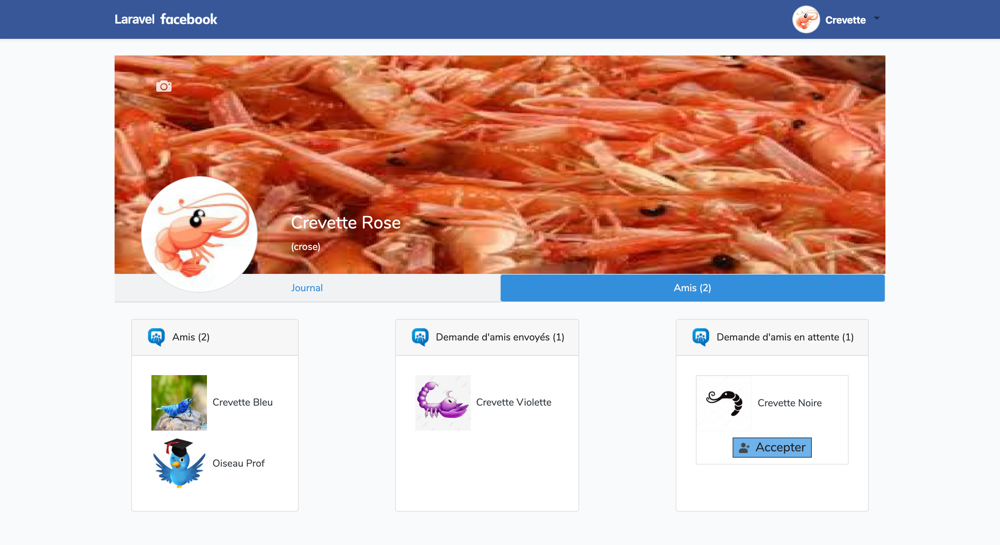

## XI. Demandes d'amis

Les demandes d'amis se feront directement sur votre profil ou par recherche d'un profil utilisateur ou encore sur la timeline.

Vos demandes d'amis en attente et vos amis seront eux affichés uniquement sur votre profil. Vous aurez la possibilité d'accepter une demande d'amis ou de la refuser et vous pourrez également supprimer un de vos amis.

### A. Création de la Migration/Table "Amis"

-   Crée une migration pour effectuer des demandes d'amis

```
php artisan make:migration create_amis_table
```

Son contenu initial est le suivant :

```php
<?php

use Illuminate\Database\Migrations\Migration;
use Illuminate\Database\Schema\Blueprint;
use Illuminate\Support\Facades\Schema;

class CreateAmisTable extends Migration
{
    /**
     * Run the migrations.
     *
     * @return void
     */
    public function up()
    {
        Schema::create('amis', function (Blueprint $table) {
            $table->id();
            $table->timestamps();
        });
    }

    /**
     * Reverse the migrations.
     *
     * @return void
     */
    public function down()
    {
        Schema::dropIfExists('amis');
    }
}
```

-   Modification du contenu pour faire correspondre nos amis et nous même

    -   Ajout d'un champ "amis_id" faisant la liaison avec l'id de l'utilisateurs de la table "users" qui reçoit la demande.
    -   Ajout d'un champ "user_id" faisant la liaison avec l'id de l'utilisateurs de la table "users" qui fait la demande.
    -   Ajout d'un champ booléen "active" qui gère la demande d'amis

        -   Si "demande d'amis" alors création de la liaison dans la table avec le "active = 0"
        -   Si active = 0 alors "demande d'amis en attente".
        -   Si active = 1 alors "demande d'amis accépté".

        Pour la suppression d'amis, cela supprimera directement la liaison.

```php
    $table->integer('user_id')->unsigned();
    $table->integer('amis_id')->unsigned();
     $table->boolean('active');
```

-   Lancement de la migration

```
php artisan migrate
```

### B. Création du Model /Modification du Model "User.php"

1. Création du model "Amis.php" :

```
php artisan make:model Amis
```

Le model permet la liaison entre les différentes tables mais aussi de vérifier que la valeur correspond bien à ce que le champs demandent.

2. Nous avons donc besoin ici de rajouter les liaisons entre nos amis et notre utilisateur, pour cela écrire les fonctions suivantes dans notre model "User.php" :

```php
   public function amisAll(){
        //Relation à plusieurs n à n //table 'amis_dmd', user_id > amis_id
          //Many To Many - withPivot = recup booleen
          return $this->belongsToMany(\App\User::class, 'amis','user_id', 'amis_id')->withPivot('active')->withPivot('created_at');
    }

    public function amisActive()
    {
         //Relation à plusieurs n à n //table 'amis_dmd', user_id > amis_id
        return $this->belongsToMany(\App\User::class, 'amis','user_id', 'amis_id')
            ->withPivot('active')->withPivot('created_at')
            ->wherePivot('active', true);
    }

    public function amisNotActive()
    {
        return $this->belongsToMany(\App\User::class ,'amis','user_id', 'amis_id')
            ->withPivot('active')->withPivot('created_at')
            ->wherePivot('active', false);
    }
    public function amisWait()
    {
        return $this->belongsToMany(\App\User::class ,'amis','amis_id', 'user_id')
            ->withPivot('active')->withPivot('created_at')
            ->wherePivot('active', false);
    }
```

Nos modèles sont désormais prêt !

### B. Gestion des amis dans le controller

Comme expliquer précédemment les demandes d'amis se géreront dans le profil, nous utiliserons donc le controller correspondant au profil ici "ProfilController".

Ajouter donc dans votre controller les fonctions suivantes :

1. Fonction de demande d'amis en attente d'acceptation

```php
public function amis_add($id, User $user)
    {
        $user_id = Auth::user()->id;
        $amis_add = $user->where('id', $id)->first();

        $amis = new Amis;
        $amis->user_id = $user_id;
        $amis->amis_id = $amis_add->id;
        $amis->active = 0;
       //dd($amis);
        $amis->save();

        return redirect()->back()->withOk("La demande d'amis à été envoyé à " . $amis_add->name ." ". $amis_add->firstname ." et est en attente de sa réponse !");
    }
```

2. Fonction de demande d'amis accepté

```php
    public function amis_invit($id, Amis $amis, User $user)
    {
        $user_id = Auth::user()->id;
        $amis_invit = $user->where('id', $id)->first();

       //Création de la liaison dans l'autre sens c'est-à-dire user vers amis avec active = 1 pour accepter la demande
        //where == request
        $amis = new Amis;
        $amis->user_id = $user_id;
        $amis->amis_id = $amis_invit->id;
        $amis->active = 1;
       //dd($amis);
        $amis->save();

        //Acceptation de la demande d'amis en passant le active à 1 de la liaison crée précédemment amis vers user
        $amisAccept = $amis
        ->where('amis_id', $user_id)
        ->where('user_id', $amis_invit->id)
        ->first();
        $amisAccept->active = 1;
        $amisAccept->update();

        return redirect()->back()->withOk("Vous avez accepter la demande d'amis de " . $amis_invit->name ." ". $amis_invit->firstname . " !");
    }
```

3. Fonction de suppression d'un amis

```php
    public function amis_delete($id, Amis $amis, User $user)
    {
        $user_id = Auth::user()->id;
        $amis_delete = $user->where('id', $id)->first();

        //Suppression de la liaison  user > amis
        $amis = $amis
            ->where('user_id', $user_id)
            ->where('amis_id', $amis_delete->id)
            ->first();
           // dd($amis);
        $amis->delete();

        //Supression de la liaison amis > user
        $amisLiaison = $amis
        ->where('user_id', $amis_delete->id)
        ->where('amis_id', $user_id)
        ->first();
       // dd($amis);
        $amisLiaison->delete();

        return redirect()->back()->withOk("Vous n'êtes plus amis avec " . $amis_delete->name ." ". $amis_delete->firstname . " !");
    }
```

### C. Vue

#### \_\_Boutons

-   Création des boutons pour procéder à la demande d'amis, voir que l'invitation à été envoyée et à la suppresion d'un amis sur la page de profil des utilisateurs "profil.blade.php".

1. Bouton d'action d'ajout, "Ajouter" :

```php
<a class="text-decoration-none text-dark" href="{{ route('profil.amisAdd', $user->id)}}" role="button"
    aria-pressed="true">
    <div class="border border-dark"
        style="position: absolute;   top: 84%;   left: 90%;  transform: translate(-50%,-50%)">
        <div class="bg-light d-flex m-auto">
            <div class="ml-2">
                
            </div>
            <p class="my-auto mx-2">Ajouter</p>
        </div>
    </div>
</a>
```

2. Bouton d'information, "Invitation envoyée" :

```php
    <div class="border border-dark"
        style="position: absolute;   top: 84%;   left: 90%;  transform: translate(-50%,-50%); width:160px;">
        <div class="bg-light d-flex m-auto">
            <div class="ml-2">
                
            </div>
            <p class="my-auto mx-2">Invitation envoyée</p>
        </div>
    </div>
```

3. Bouton d'action de suppression d'amis, "Retirer des amis" :

```php
<a class="text-decoration-none text-dark" href="{{ route('profil.amisDelete', $user->id)}}"
    role="button" aria-pressed="true">
    <div class="border border-dark"
        style="position: absolute;   top: 84%;   left: 90%;  transform: translate(-50%,-50%); width:160px;">
        <div class="bg-light d-flex m-auto">
            <div class="ml-2">
                
            </div>
            <p class="my-auto mx-2">Retirer des amis</p>
        </div>
    </div>
</a>
```

Bonus :

```php
    <div class="border border-dark"
        style="position: absolute;   top: 84%;   left: 90%;  transform: translate(-50%,-50%); width:160px;">
        <div class="bg-light d-flex m-auto">
            <div class="ml-2">
                
            </div>
            <p class="my-auto mx-2">Invitation reçue</p>
        </div>
    </div>
```

#### \_\_Condition

//**_Attention cette partie n'est pas fonctionnel pour le moment !_**

-   Condition permettant d'afficher un bouton selon le profil sur lequel nous nous trouvons.

1. Si c'est pas un amis et que aucune demande n'a été précédemment envoyé alors "Ajouter".
2. Si j'ai envoyé une invitation à devenir amis "Invitation envoyée".
3. Si c'est un amis alors "Retirer des amis".

Bonus ? : Si l'utlisateur n'est pas mon amis mais m'as envoyé une demande d'amis alors "Invitation reçue" .

```php
  <!-- Bouton de demande d'amis "Ajouter"-->
@if($user->name != Auth::user()->name)
@if($amis == false)
<a class="text-decoration-none text-dark" href="{{ route('profil.amisAdd', $user->id)}}" role="button"
    aria-pressed="true">
    <div class="border border-dark"
        style="position: absolute;   top: 84%;   left: 90%;  transform: translate(-50%,-50%)">
        <div class="bg-light d-flex m-auto">
            <div class="ml-2">
                
            </div>
            <p class="my-auto mx-2">Ajouter</p>
        </div>
    </div>
</a>
@elseif($amis->amisDemande == false && $amis->amisActive == false)
<a class="text-decoration-none text-dark" href="{{ route('profil.amisInvit', $user->id)}}" role="button"
    aria-pressed="true">
    <div class="border border-dark"
        style="position: absolute;   top: 84%;   left: 90%;  transform: translate(-50%,-50%); width:160px;">
        <div class="bg-light d-flex m-auto">
            <div class="ml-2">
                
            </div>
            <p class="my-auto mx-2">Invitation envoyée</p>
        </div>
    </div>
</a>
@else
<a class="text-decoration-none text-dark" href="{{ route('profil.amisDelete', $user->id)}}"
    role="button" aria-pressed="true">
    <div class="border border-dark"
        style="position: absolute;   top: 84%;   left: 90%;  transform: translate(-50%,-50%); width:160px;">
        <div class="bg-light d-flex m-auto">
            <div class="ml-2">
                
            </div>
            <p class="my-auto mx-2">Retier des amis</p>
        </div>
    </div>
</a>
@endif
@endif
```

-   Code de l'application crush pour m'aider, merci de ne pas copier cela

```php
<ul class="card-body">
    @foreach ($user->amis as $amis)
    <li>{{ $amis->id }} - {{ $tag->name }} - Pivot Active = {{ $amis->pivot->active }}
        @if($amis->pivot->active) ✅ @else ❌ @endif > Created at
        {{ $amis->pivot->created_at->diffForHumans() }}
    </li>
      <li>{{ $amis->id }} - {{ $tag->name }} - Pivot Active = {{ $amis->pivot->active }}
        @if($amis->pivot->tagActive) ✅ @else ❌ @endif > Created at
        {{ $amis->pivot->created_at->diffForHumans() }}
    </li>
    @endforeach
</ul>
```

//**_Attention cette partie n'est pas fonctionnel pour le moment !_**

#### Édition du bloc vue des amis

Ce bloc accueillera les amis de la personne, les demandes d'amis qu'elle aura envoyé aux autres utilisateurs ainsi que les demandes d'amis reçues par les autres utilisateurs.

-   Pour ce faire, nous devons donc modifier le bloc précédemment crée :

```php
   <!-- Partie Amis -->
                <div class="tab-pane fade bg-white" id="nav-profile" role="tabpanel" aria-labelledby="nav-profile-tab">
                    coucou amis
                </div>
```

Nous allons y ajouter notre code pour faire apparaître ses différents paramètres.

<details>
<summary>Voir le code</summary>

```php
<!-- Partie Amis -->
<div class="tab-pane fade " id="nav-profile" role="tabpanel" aria-labelledby="nav-profile-tab">
   <!-- Condition d'affichage des amis actifs pour l'utlisateur pas connecté -->
    @if($user->name != Auth::user()->name)
    <!-- Contenu des amis-->
    <div class="card m-1">
        <div class="card-header d-flex">
            <div></div>
            <p class="my-auto ml-2">Amis ({{$user->amisActive->count()}})</p>
        </div>
        <div class="card-body d-flex flex-wrap">
            <!-- Boucle d'affichage des amis actifs -->
            @foreach ($user->amisActive as $amis)
            <div class="m-2 border border-lightgrey">
                <a href="{{ route('profil', $amis->id) }}" class="text-decoration-none text-dark">
                    <div class="d-flex">
                        avatar}}" alt="" width="80">
                        <p class="p-2 my-auto">{{$amis->firstname}} {{$amis->name}}</p>
                    </div>
                </a>
            </div>
            @endforeach
        </div>
    </div>
    @else
    <div class="d-flex justify-content-between">

        <!-- Contenu des amis-->
        <!-- Affichage des amis actifs pour l'utilisateur connectée -->
        <div class="card m-1">
            <div class="card-header d-flex">
                <div></div>
                <p class="my-auto ml-2">Amis ({{$user->amisActive->count()}})</p>
            </div>
            <div class="card-body">
               <!-- Boucle d'affichage des amis actifs -->
                @foreach ($user->amisActive as $amis)
                <div class="m-2">
                    <a href="{{ route('profil', $amis->id) }}" class="text-decoration-none text-dark">
                        <div class="d-flex">
                            avatar}}" alt="" width="80">
                            <p class="p-2 my-auto">{{$amis->firstname}} {{$amis->name}}</p>
                        </div>
                    </a>
                    <a href="{{ route('profil', $amis->id) }}" class="text-decoration-none text-dark">

                    </a>
                </div>
                @endforeach
            </div>
        </div>

        <!-- Contenu Demandes d'amis envoyés -->
        <div class="card m-1">
            <div class="card-header d-flex">
                <div></div>
                <p class="my-auto ml-2">Demande d'amis envoyés ({{$user->amisNotActive->count()}})
                </p>
            </div>
            <div class="card-body">
               <!-- Boucle d'affichage des amis pas actifs c'est-à-dire en attente chez l'amis -->
                @foreach ($user->amisNotActive as $amis)
                <div class="m-2">
                    <a href="{{ route('profil', $amis->id) }}" class="text-decoration-none text-dark">
                        <div class="d-flex">
                            avatar}}" alt="" width="80">
                            <p class="p-2 my-auto">{{$amis->firstname}} {{$amis->name}}</p>
                        </div>
                    </a>
                </div>
                @endforeach
            </div>
        </div>

        <!-- Contenu Demandes d'amis en attente -->
        <div class="card m-1">
            <div class="card-header d-flex">
                <div></div>
                <p class="my-auto ml-2">Demande d'amis en attente
                    ({{$user->amisWait->count()}})
                </p>
            </div>
            <div class="card-body">
            <!-- Boucle d'affichage des amis pas actifs c'est-à-dire en attente chez moi -->
                @foreach ($user->amisWait as $amis)
                <div class="m-2 border border-lightgrey">
                    <a href="{{ route('profil', $amis->id) }}" class="text-decoration-none text-dark">
                        <div class="d-flex">
                            avatar}}" alt="" width="80"
                                height="80">
                            <p class="p-2 my-auto">{{$amis->firstname}} {{$amis->name}}</p>
                        </div>
                    </a>
                    <a class="btn btn-lg justify-content-center d-flex text-decoration-none"
                        href="{{ route('profil.amisInvit', $amis->id)}}" role="button"
                        aria-pressed="true">
                        <div class="border border-dark bg-info">
                            <div class="d-flex m-auto">
                                <div class="ml-2">
                                    
                                </div>
                                <p class="my-auto mx-2">Accepter</p>
                            </div>
                        </div>
                    </a>

                </div>
                @endforeach
            </div>
        </div>
    </div>
    @endif
</div>
```

</details>

Nos demande d'amis sont désormais fonctionnelles et prête à l'emploi ! Tester-les !

### D. Rendu visuel

#### Partie Journal avec amis


#### Partie Amis du profil de l'utilisateur connecté



#### Partie Amis du profil de l'utlisateur non connecté


#### Profil Utilisateur - Etapes

1. Ajout
2. Invitation envoyée
3. Retirer des amis
   Bonus : Invitation reçue
