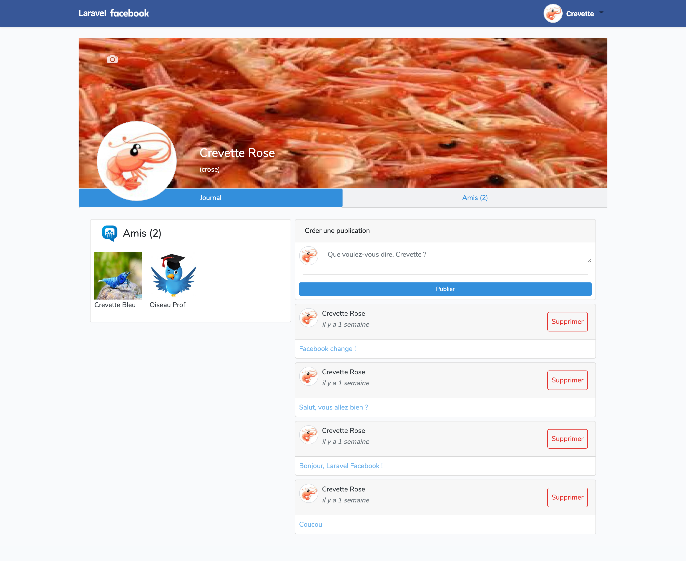

## XII. J'aime / J'aime pas

### A. Création de la Migration/Table "Like_Unlike"

-   Crée une migration pour effectuer des posts

```
php artisan make:migration create_likes_table
```

Son contenu initial est le suivant :

```php
<?php

use Illuminate\Database\Migrations\Migration;
use Illuminate\Database\Schema\Blueprint;
use Illuminate\Support\Facades\Schema;

class CreateLikesTable extends Migration
{
    /**
     * Run the migrations.
     *
     * @return void
     */
    public function up()
    {
        Schema::create('likes', function (Blueprint $table) {
            $table->id();
            $table->timestamps();
        });
    }

    /**
     * Reverse the migrations.
     *
     * @return void
     */
    public function down()
    {
        Schema::dropIfExists('likes');
    }
}

```

-   Modification du contenu pour faire correspondre nos likes à nos posts et à nos utilisateurs

    -   Ajout d'un champ faisant la liaison avec l'id de l'utilisateurs de la table "users".
    -   Ajout d'un champ faisant la liaison avec le post de l'utilisateurs de la table "posts".

```php
  $table->integer('user_id')->unsigned();
  $table->integer('post_id')->unsigned();
```

-   Lancement de la migration

```
php artisan migrate
```

### B. Création du Model /Modification du Model "User.php"

1. Création du model "Like.php" :

```
php artisan make:model Likes
```

Le model permet la liaison entre les différentes tables mais aussi de vérifier que la valeur correspond bien à ce que le champs demandent.

```php
<?php

namespace App;

use Illuminate\Database\Eloquent\Model;

class Like extends Model
{
    //
}

```

2. Nous avons donc besoin ici de rajouter les liaisons entre nos likes, nos posts et notre utilisateur, pour cela écrire les fonctions suivantes dans notre model "User.php" :

```php
public function like_unlike(){
        //Relation à plusieurs n à n //table 'like_unlike', post_id > user_id
        return $this->belongsToMany(User::class, 'like_unlike','user_id', 'post_id')->withPivot('created_at');
        }
```

Nos modèles sont désormais prêt !

### C. Gestion des J'aime / J'aime pas dans le controller

Les "J'aime / J'aime pas" se géreront dans la home, nous utiliserons donc le controller correspondant au post ici "PostController".

Pour ce qui est de l'affichage du nombre de j'aime cela se gérera dans le profil "ProfilController" mais aussi sur la timeline gérer par le "PostController" dans leurs fonctions _index()_.

-   Ajouter donc dans votre controller les fonctions suivantes :

1. Fonction d'ajout d'un like

```php
  public function like($id,  Post $post)
    {
        $user_id = Auth::user()->id;
        $post_id = $post->where('id', $id)->first();

        $like = new Like_Unlike;
        $like->user_id = $user_id;
        $like->post_id = $post->id;
        $like->save();

        return redirect()->back()->withOk("Vous aimer le post : " . $post_id->text . " !");
    }
```

2. Fonction de suppression d'un like soit unlike

```php
     public function unlike($id, Like_Unlike $like_unlike,  Post $post)
    {
        $user_id = Auth::user()->id;
        $post_id = $post->where('id', $id)->first();

        //where == request
        $unlike = $like_unlike
            ->where('user_id', $user_id)
            ->where('post_id', $post->id)
            ->first();

        $unlike->delete();

        return redirect()->back()->withOk("Vous n'aime plus le post : " . $post_id->text . " !");
    }
```

N'oubliez pas d'importer la référence à la table

```php
use App\Like_Unlike;
```

-   Ajout dans la fonction _index()_ pour l'affichage des likes :

```php
  public function index($id, Post $post, User $user, Like_Unlike $like_unlike)
    {
        //Post de tout le monde
        //$posts = $post->orderBy('id', 'DESC')->where('user_id', Auth::user()->id)->paginate(4);

        //Post de la personne connecté et de ses amis
        $posts = $post
        //récupère les posts des amis
        ->whereIn('user_id', Auth::user()->amisActive()->pluck('amis_id'))
        //récupère les posts de l'utilisateur connecté
        ->orWhere('user_id', Auth::user()->id)
        ->with('user')
        ->orderBy('id', 'DESC')
        ->paginate(4);

        //Retourne la view des posts

        //Récupère tous les users excepté l'utilisateur connecté et les amis actifs
        $users = $user->orderBy('id', 'DESC')->get()
        ->except(Auth::user()->id)->except(Auth::user()->amisActive()->pluck('amis_id')->toArray());

        //Récupère tous les likes des posts des différents users
        $user_id = Auth::user()->id;
        $post = $post->where('id', $id)->first();
        $islike = $like_unlike
        ->where('user_id', $user_id)
        ->where('post_id', $post->id)
        ->first();

        return view('home', ['posts' => $posts, 'users' => $users, 'islike' => $islike  ]);
    }
```

### D. Gestion des routes

-   Ajouter les ligne suivante pour que la liaison entre vos boutons dans la vue et votre controller se fassent

```php
Route::get('/home/{id}/like', 'PostController@like')->name('post.like');
Route::get('/home/{id}/unlike', 'PostController@unlike')->name('post.unlike');
```

### E. Vue

#### \_\_Boutons

-   Création des boutons pour procéder au j'aime et j'aime pas des différents posts sur la page de profil des utilisateurs "profil.blade.php" et aussi sur la page "home.blade.php" c'est-à-dire la où nos posts apparaissent.

1. Bouton d'action d'ajout, "J'aime" :

```php
    <a href="{{route('post.like', $post->id)}}"
        class="text-decoration-none text-secondary w-50">
        <div class="d-flex m-0 justify-content-center">
            
            <p class="px-1 m-0 my-auto">J'aime</p>
        </div>
    </a>
```

2. Bouton d'action de suppression du j'aime, "J'aime pas" :

```php
    <a href="{{route('post.unlike', $post->id)}}"
        class="text-decoration-none text-secondary w-50 d-none">
        <div class="d-flex m-0 justify-content-center">
            
            <p class="px-1 m-0 my-auto text-primary">J'aime</p>
        </div>
    </a>
```

#### \_\_Condition

-   Condition permettant d'afficher ou j'aime pour aimer le post ou j'aime pas pour ne plus aimer le post.

1. Si pas aimé alors "J'aime".
2. Si aimé alors "J'aime pas".

```php
@if($islike == false)
    <a href="{{route('post.like', $post->id)}}"
        class="text-decoration-none text-secondary w-50">
        <div class="d-flex m-0 justify-content-center">
            
            <p class="px-1 m-0 my-auto">J'aime</p>
        </div>
    </a>
@else
    <a href="{{route('post.unlike', $post->id)}}"
        class="text-decoration-none text-secondary w-50 d-none">
        <div class="d-flex m-0 justify-content-center">
            
            <p class="px-1 m-0 my-auto text-primary">J'aime</p>
        </div>
    </a>
@endif
```

#### Édition du bloc vue des amis

Ce bloc accueillera les amis de la personne, les demandes d'amis qu'elle aura envoyé aux autres utilisateurs ainsi que les demandes d'amis reçues par les autres utilisateurs.

-   Pour ce faire, nous devons donc modifier le bloc précédemment crée :

```php
   <!-- Partie Amis -->
                <div class="tab-pane fade bg-white" id="nav-profile" role="tabpanel" aria-labelledby="nav-profile-tab">
                    coucou amis
                </div>
```

Nous allons y ajouter notre code pour faire apparaître ses différents paramètres.

<details>
<summary>Voir le code</summary>

```php
<!-- Partie Amis -->
<div class="tab-pane fade " id="nav-profile" role="tabpanel" aria-labelledby="nav-profile-tab">
   <!-- Condition d'affichage des amis actifs pour l'utlisateur pas connecté -->
    @if($user->name != Auth::user()->name)
    <!-- Contenu des amis-->
    <div class="card m-1">
        <div class="card-header d-flex">
            <div></div>
            <p class="my-auto ml-2">Amis ({{$user->amisActive->count()}})</p>
        </div>
        <div class="card-body d-flex flex-wrap">
            <!-- Boucle d'affichage des amis actifs -->
            @foreach ($user->amisActive as $amis)
            <div class="m-2 border border-lightgrey">
                <a href="{{ route('profil', $amis->id) }}" class="text-decoration-none text-dark">
                    <div class="d-flex">
                        avatar}}" alt="" width="80">
                        <p class="p-2 my-auto">{{$amis->firstname}} {{$amis->name}}</p>
                    </div>
                </a>
            </div>
            @endforeach
        </div>
    </div>
    @else
    <div class="d-flex justify-content-between">

        <!-- Contenu des amis-->
        <!-- Affichage des amis actifs pour l'utilisateur connectée -->
        <div class="card m-1">
            <div class="card-header d-flex">
                <div></div>
                <p class="my-auto ml-2">Amis ({{$user->amisActive->count()}})</p>
            </div>
            <div class="card-body">
               <!-- Boucle d'affichage des amis actifs -->
                @foreach ($user->amisActive as $amis)
                <div class="m-2">
                    <a href="{{ route('profil', $amis->id) }}" class="text-decoration-none text-dark">
                        <div class="d-flex">
                            avatar}}" alt="" width="80">
                            <p class="p-2 my-auto">{{$amis->firstname}} {{$amis->name}}</p>
                        </div>
                    </a>
                    <a href="{{ route('profil', $amis->id) }}" class="text-decoration-none text-dark">

                    </a>
                </div>
                @endforeach
            </div>
        </div>

        <!-- Contenu Demandes d'amis envoyés -->
        <div class="card m-1">
            <div class="card-header d-flex">
                <div></div>
                <p class="my-auto ml-2">Demande d'amis envoyés ({{$user->amisNotActive->count()}})
                </p>
            </div>
            <div class="card-body">
               <!-- Boucle d'affichage des amis pas actifs c'est-à-dire en attente chez l'amis -->
                @foreach ($user->amisNotActive as $amis)
                <div class="m-2">
                    <a href="{{ route('profil', $amis->id) }}" class="text-decoration-none text-dark">
                        <div class="d-flex">
                            avatar}}" alt="" width="80">
                            <p class="p-2 my-auto">{{$amis->firstname}} {{$amis->name}}</p>
                        </div>
                    </a>
                </div>
                @endforeach
            </div>
        </div>

        <!-- Contenu Demandes d'amis en attente -->
        <div class="card m-1">
            <div class="card-header d-flex">
                <div></div>
                <p class="my-auto ml-2">Demande d'amis en attente
                    ({{$user->amisWait->count()}})
                </p>
            </div>
            <div class="card-body">
            <!-- Boucle d'affichage des amis pas actifs c'est-à-dire en attente chez moi -->
                @foreach ($user->amisWait as $amis)
                <div class="m-2 border border-lightgrey">
                    <a href="{{ route('profil', $amis->id) }}" class="text-decoration-none text-dark">
                        <div class="d-flex">
                            avatar}}" alt="" width="80"
                                height="80">
                            <p class="p-2 my-auto">{{$amis->firstname}} {{$amis->name}}</p>
                        </div>
                    </a>
                    <a class="btn btn-lg justify-content-center d-flex text-decoration-none"
                        href="{{ route('profil.amisInvit', $amis->id)}}" role="button"
                        aria-pressed="true">
                        <div class="border border-dark bg-info">
                            <div class="d-flex m-auto">
                                <div class="ml-2">
                                    
                                </div>
                                <p class="my-auto mx-2">Accepter</p>
                            </div>
                        </div>
                    </a>

                </div>
                @endforeach
            </div>
        </div>
    </div>
    @endif
</div>
```

</details>

Nos demande d'amis sont désormais fonctionnelles et prête à l'emploi ! Tester-les !

### F. Rendu visuel

#### Partie Journal avec amis



#### Partie Amis du profil de l'utilisateur connecté


#### Partie Amis du profil de l'utlisateur non connecté


#### Profil Utilisateur - Etapes

1. Ajout
2. Invitation envoyée
3. Retirer des amis
   Bonus : Invitation reçue
