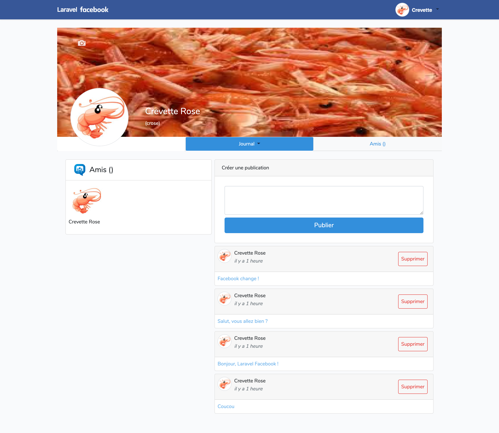

## X. Voir ses posts sur son profil

### A. Partie de la vue des posts

-   Modification de l'affichage des posts, remplacer la partie des publications comme suit :

```php
  <!-- Publication -->
    @if(!$posts)
    <div class="card my-2">
        <div class="card-header">Fil d'actualité</div>
        <div class="card-body">Aucune publication</div>
    </div>
    @else
    @foreach ($posts as $post)
    @if($post->user->name === $user->name)
    @csrf
    <div class="card my-2">
        <div class="card-header d-flex my-auto p-2">
            <div class="mr-2">user->getAvatar()}}" alt="" width="40"></div>
            <div class="mr-auto">
                <p class="my-auto">{{$post->user->firstname}} {{$post->user->name}}</p>
                <p class="text-muted mr-2 my-auto text-secondary font-italic">
                    {{$post->created_at->locale('fr_FR')->diffForHumans()}}</p>
            </div>
            <form action="{{route('destroy.post', $post->id)}}" method="DELETE" id="myform"
                class="p-2">
                @if ($post->user->id === Auth::user()->id)
                <button type="submit" class="btn btn-outline-danger p-2" onclick="if(confirm('Voulez-vous vraiment supprimer ce post ?')){
                            return true;}else{ return false;}">Supprimer</button>
                @endif
            </form>
        </div>
        <div class="card-body outer p-2">
            <p class="m-0 text-info">
                {{$post->text }}
            </p>

        </div>

    </div>
    @endif
    @endforeach
    @endif
```

### B. ProfilController

-   Ajout de la ligne d'affichage de ses posts a la fonction index :

```php
 $posts = $post->orderBy('id', 'DESC')->get();
```

N'oublier pas d'ajouter la référence dans l'appel de la fonction, ainsi que l'import

```php
//Import des posts
use App\Post;
//Ajout des posts a notre fonction
public function index($slug, User $user, Post $post)
```

-   Code entier :

```php
use App\Post;
    public function index($slug, User $user, Post $post)
    {
        $u = $user->wherePseudo($slug)->first();

        if (!$u) {
            $u = $user->whereId($slug)->first();
            if (!$u) {
                return redirect('/', 302);
            }
        }
        $posts = $post->orderBy('id', 'DESC')->get();

        //Retourne la view des posts
        return view('/auth/profil', [ 'user' => $u , 'posts' => $posts]);
    }
```

### C. Rendu affichage de ses posts


