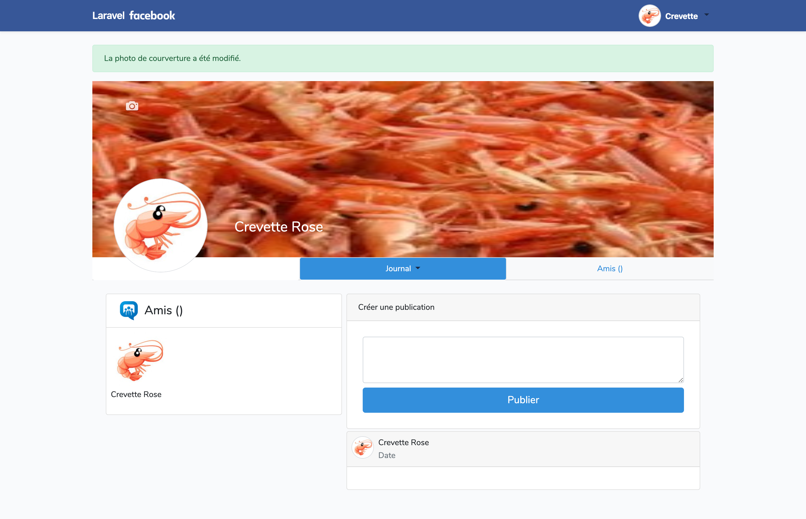

## VIII - Création de la page "Profil"

_Création de la page profil avec le controller et les routes associés "ProfilController", possibilité de modifier son avatar et sa photo de couverture_

### A. Création de la vue

Cette page permettra à l'utilisateur de voir son profil, c'est-à-dire de pouvoir poster un commentaire, voir ses demandes d'amis et ses amis.

-   Crée le fichier **"profil.blade.php"** dans /ressources/views

```php
@extends('layouts.app')
@section('content')
<h1>Page Compte</h1>
@endsection
```

-   Ajout du lien dans la barre de navigation du fichier **"app.blade.php"**

```php
  <a class="dropdown-item" href="{{ route('profil', Auth::user()->id ) }}">Profil</a>
```

### B. Création du controleur

1. Controlleur "ProfilController"

    `php artisan make:controller ProfilController`

-   Contenu du controlleur :

```php
  public function index($slug, User $user)
    {
        $u = $user->wherePseudo($slug)->first();

        if (!$u) {
            $u = $user->whereId($slug)->first();
            if (!$u) {
                return redirect('/', 302);
            }
        }

        //Retourne la view des posts
        return view('/auth/profil', [ 'user' => $u ]);
    }

       public function updateAvatar(User $user)
    {
        $request = app('request');
        $path = null;
        // Logic for user upload of avatar
        if ($request->hasFile('avatar')) {
            $avatar = $request->file('avatar');
            $filename = time() . '.' . $avatar->getClientOriginalExtension();
            $path = '/uploads/avatars/' . $filename;
            Image::make($avatar)->resize(200, 200)->save(public_path($path));
            $user = Auth::user();
            $user->avatar = $path;
            $user->save();
        }

    return redirect::back()->withOk("L'avatar a été modifié.");
    }

     public function updateCover(User $user)
    {
        $request = app('request');
        $path = null;
        // Logic for user upload of avatar
        if ($request->hasFile('cover')) {
            $cover = $request->file('cover');
            $filename = time() . '.' . $cover->getClientOriginalExtension();
            $path = '/uploads/covers/' . $filename;
            Image::make($cover)->resize(200, 200)->save(public_path($path));
            $user = Auth::user();
            $user->cover = $path;
            $user->save();
        }

    return redirect::back()->withOk("La photo de courverture a été modifié.");
    }
```

### C. Création de la route

-   Gestion par le pseudo ou par l'identifiant

    `Route::get('/profil/{slug}', 'ProfilController@index')->name('profil');`

-   Modification de la photo de profil :
    `Route::post('profil/{slug}', 'ProfilController@updateAvatar')->middleware('auth')->name('profil.updateAvatar');`

-   Modification de la photo de couverture :
    `Route::post('profil', 'ProfilController@updateCover')->middleware('auth')->name('profil.updateCover');`

### D. Optimisation de la vue

1. Vue du profil sans les données du fil d'actualité et du post d'une commentaire

<details>
<summary>Code vue "profil.blade.php"</summary>

```php
@extends('layouts.app')
@section('title')
Laravel Facebook - Profil
@endsection

@section('style')
<style>
    .img-avatar>.bg-black {
        opacity: 0;
        transition: all 0.5s ease;
    }

    .img-avatar>.bg-black:hover {
        opacity: 1;
    }

    .bg-black {
        background: #00000099;
        top: 50%;
        position: absolute;
        width: 100%;
        height: 50%;
    }

    #dialogEditAvatar[open] {
        display: block;
        background: aliceblue;
        border-radius: 20px;
        border: 1px solid darkblue;
        top: 50%;
        left: 35%;
        transform: translate(-50%, -50%);
        position: absolute;
    }

    .photo-cover {
        left: 5%;
        display: flex;
        position: absolute;
        top: 10%;
        border-radius: 3px;
        padding: 2px;
    }

    .img-cover>.bg-cover {
        opacity: 0;
        transition: all 0.5s ease;
    }

    .img-cover>.bg-cover:hover {
        opacity: 1;
    }

    .bg-cover {
        left: 5%;
        display: flex;
        position: absolute;
        top: 10%;
        background: #00000099;
        border: 1px solid white;
        border-radius: 3px;
        padding: 2px;
        height: 28px;
    }

    #dialogEditCover[open] {
        display: block;
        background: aliceblue;
        border-radius: 20px;
        border: 1px solid darkblue;
        top: 50%;
        left: 35%;
        transform: translate(-50%, -50%);
        position: absolute;
    }

</style>
@endsection
@section('content')

<div class="container">
    <div class="row justify-content-center">
        <div class="col-md-12">
            @if(session()->has('ok'))
            <div class="alert alert-success alert-dismissible">{!! session('ok') !!}</div>
            @endif
            <div class="position-relative">
                <a class="img-cover" onclick="showDialogEditCover()">
                    getCover()}}" alt="" width="100%" height="315">
                    <div class="photo-cover">
                        
                    </div>
                    <div class="bg-cover">
                        <div class="text-center">
                            
                        </div>
                        <p class="text-white mx-2">Modifier la photo de courverture</p>
                    </div>
                </a>
                <div class="mx-auto mb-2"
                    style="width:168px; height:168px; position: absolute;   top: 82%;   left: 11%;  transform: translate(-50%,-50%); border-radius:50%; overflow:hidden;">
                    <a class="img-avatar" onclick="showDialogEditAvatar()">
                        getAvatar()}}" width="100%" height="100%">
                        <div class="bg-black">
                            <div class="text-center mt-2">
                                
                            </div>
                            <p class="text-white text-center">Mettre à jour</p>
                        </div>
                    </a>
                </div>
                <div style="position: absolute;   top: 84%;   left: 30%;  transform: translate(-50%,-50%)">
                    <H3 class="text-white">{{$user->firstname}} {{$user->name}}</H3>
                    @if($user->pseudo)
                    <p class="text-white">({{$user->pseudo}})</p>
                    @endif
                </div>
            </div>
            <nav class="nav-pills nav-justified">
                <div class="nav nav-tabs bg-light card-header p-0" id="nav-tab" role="tablist"
                    style="justify-content: space-between;">
                    <a class="nav-item nav-link bg-white" id="nav-home-tab" data-toggle="tab" href="#nav-home"
                        role="tab" aria-controls="nav-home" aria-selected="true">
                    </a>
                    <a class="nav-item nav-link dropdown-toggle active" id="nav-home-tab" data-toggle="tab"
                        href="#nav-home" role="tab" aria-controls="nav-home" aria-selected="true">Journal
                        <span class="caret"></span>
                    </a>
                    <a class="nav-item nav-link" id="nav-profile-tab" data-toggle="tab" href="#nav-profile" role="tab"
                        aria-controls="nav-profile" aria-selected="false">

                        Amis ()
                    </a>
                </div>
            </nav>

            <div class="tab-content card-body" id="nav-tabContent">

                <!-- Partie Journal -->
                <div class="tab-pane fade show active d-flex" id="nav-home" role="tabpanel"
                    aria-labelledby="nav-home-tab">

                    <!-- Contenu gauche Amis -->
                    <div class="card w-50 m-1 h-50">
                        <div class="d-flex card-header bg-white my-auto">
                            <div></div>
                            <H4 class="my-auto ml-2">Amis ()</H4>
                        </div>

                        <div class="d-flex flex-wrap">
                            <div class="m-2">
                                <div class="">
                                    avatar}}" alt="" width="100">
                                </div>
                                <p>{{$user->firstname}} {{$user->name}}</p>
                            </div>


                        </div>
                    </div>

                    <!-- Contenu journal -->
                    <div class="w-75 m-1">
                        <!-- Créer une Publication -->
                        <div class="card mb-1">
                            <div class="card-header">Créer une publication</div>
                            <div class="card-body">
                                @if ($errors->any())
                                <div class="alert alert-danger">
                                    <ul>
                                        @foreach ($errors->all() as $error)
                                        <li>{{ $error }}</li>
                                        @endforeach
                                    </ul>
                                </div>
                                @endif
                                <div class="form-group m-2 ">
                                    <form method="post" action="">
                                        <input type="hidden" name="user_id" value="{{ Auth::user()->id }}">
                                        <textarea name="text"
                                            class="form-control @error('text') is-invalid @enderror mb-2" id="text"
                                            rows="3">{{ old('text') }}</textarea>
                                        {{csrf_field()}}
                                        <button href="#" class="btn btn-primary btn-lg btn-block" role="button"
                                            aria-pressed="true" type="submit">Publier</button>
                                    </form>
                                </div>
                            </div>
                        </div>

                        <!-- Publication -->
                        <div class="card mb-1">
                            <div class="card-header d-flex my-auto p-2">

                                <div class="mr-2">avatar}}" alt="" width="40"></div>
                                <div>
                                    <p class="my-auto">{{$user->firstname}} {{$user->name}}</p>
                                    <p class="text-muted mr-2 my-auto">Date</p>
                                </div>
                            </div>
                            <div class="card-body">


                            </div>
                        </div>

                    </div>


                </div>

                <!-- Partie Amis -->
                <div class="tab-pane fade bg-white" id="nav-profile" role="tabpanel" aria-labelledby="nav-profile-tab">
                    coucou amis
                </div>

            </div>

        </div>
    </div>
</div>
</div>
<!-- Boite de dialogue d'édition de l'avatar -->
<dialog id="dialogEditAvatar">
    <button type="button" class="close" onclick="closeDialogEdit()" aria-label="Close">
        <span aria-hidden="true">&times;</span>
    </button>
    <H3 class="text-center bg-light">Modifier la miniature</H3>
    <div class="m-2">
        <hr>
    </div>
    <div class="mx-auto mb-2" style="width:80px; height:80px;">getAvatar()}}"
            width="100%" height="100%">
    </div>
    <form action="{{ route('profil.updateAvatar', $user->id) }}" method="POST" class="text-center"
        enctype="multipart/form-data">
        @csrf
        <input type="file" id="avatar" class="form-control @error('avatar') is-invalid @enderror" name="avatar"
            accept="image/png, image/jpeg" value="{{ old('avatar') }}" autocomplete="avatar" autofocus
            onclick="changeImage();" value="">
        <button type="submit" class="btn btn-primary mt-2 text-center" style="background-color:#385898;">
            {{ __("Enregister") }}
        </button>
        </div>

    </form>
</dialog>
<script>
    var e = document.getElementById("dialogEditAvatar");

    function showDialogEditAvatar() {
        e.show();
        console.log(event.type, e, StyleSheet, x.userID);
    }

    function closeDialogEdit() {
        e.close();
        console.log(event.type, e, StyleSheet);
    }

</script>
<!-- Boite de dialogue d'édition de la photo de couverture -->
<dialog id="dialogEditCover">
    <button type="button" class="close" onclick="closeDialogEditCover()" aria-label="Close">
        <span aria-hidden="true">&times;</span>
    </button>
    <H3 class="text-center bg-light">Modifier la photo de couverture</H3>
    <div class="m-2">
        <hr>
    </div>
    <div class="mx-auto mb-2">getCover()}}" width="100%" height="100%">
    </div>
    <form action="{{ route('profil.updateCover', $user->id) }}" method="POST" class="text-center"
        enctype="multipart/form-data">
        @csrf
        <input type="file" id="cover" class="form-control @error('cover') is-invalid @enderror" name="cover"
            accept="image/png, image/jpeg" value="{{ old('cover') }}" autocomplete="cover" autofocus
            onclick="changeImage();" value="">
        <button type="submit" class="btn btn-primary mt-2 text-center" style="background-color:#385898;">
            {{ __("Enregister") }}
        </button>
        </div>

    </form>
</dialog>
<script>
    var c = document.getElementById("dialogEditCover");

    function showDialogEditCover() {
        c.show();
        console.log(event.type, e, StyleSheet, x.userID);
    }

    function closeDialogEditCover() {
        c.close();
        console.log(event.type, e, StyleSheet);
    }

</script>
@endsection


```

</details>

### E. Ajout du champ "cover"

Nous aurons également besoin d'une photo de couverture pour la suite de notre profil. Nous allons donc ajouter ce champs dans la BDD comme précédemment pour le prénom.

1. Aller dans le fichier : annnée_mois_date_000000_create_users_table.php<br>
   Ce champ est null à la création du compte<br>
   Qui se situe dans le dossier /database/migrations/

-   Ajouter la ligne concernant l'avatar : `$table->string('cover')->nullable();`

2. Dans le fichier : User.php<br>
   Qui se situe dans le dossier /app/

-   Ajouter la propriété "avatar" et une fonction pour le récuperer :

```php
 protected $fillable = [
        'avatar','cover','firstname','name', 'email', 'password',
    ];

  public function getCover() {
  if (!$this->cover) {
              return '/img/banner.jpeg';
          }
          return $this->cover;
  }

```

3. Dans le fichier de création des Users soit ici "RegisterController"<br>
   Qui se situe dans /app/Http/Controllers/Auth/

-   Ajouter la ligne concernant la photo de couverture dans la fonction create et dans User::create comme suit :

```php
use Intervention\Image\Facades\Image;

 protected function validator(array $data)
    {
        return Validator::make($data, [
            'firstname' => ['required', 'string', 'max:255'],
            'name' => ['required', 'string', 'max:255'],
            'email' => ['required', 'string', 'email', 'max:255', 'unique:users'],
            'password' => ['required', 'string', 'min:8', 'confirmed'],
        ]);
    }

      protected function create(array $data)
    {
        $request = app('request');

        $path = null;

        if($request->hasFile('avatar')){
            $avatar = $request->file('avatar');
            $filename = time() . '.' . $avatar->getClientOriginalExtension();
            $path = '/uploads/avatars/' . $filename;
            Image::make($avatar)->resize(200, 200)->save(public_path($path));
        }

         if($request->hasFile('cover')){
            $cover = $request->file('cover');
            $filename = time() . '.' . $cover->getClientOriginalExtension();
            $path = '/uploads/covers/' . $filename;
            Image::make($cover)->resize(930, 315)->save(public_path($path));
        }

        return User::create([
            'avatar' => $path,
            'cover' => $path,
            'firstname' => $data['firstname'],
            'name' => $data['name'],
            'email' => $data['email'],
            'password' => Hash::make($data['password']),
        ]);
    }
```

4. Créer le dossier "/uploads/covers/" pour crée le chemin ou les fichiers doivent s'enregister, il est situé dans le dossier "/public".

5. Lancer la migration pour que les modifications prennent effet :
   `php artisan migrate`
    - Si celui-ci affiche "Nothing to migrate".<br>
      Procéder comme suit, cela permet de revenir une modification en arrière<br>
      `php artisan migrate:rollback`<br>
      et relancer la migration<br>
      `php artisan migrate`

-   Si vous avez coupez votre serveur pour installer la bibliothèque d'image, n'oubliez pas de le relancer avec `php artisan serve`.

6. Tester la modification de la photo de courverture

.

### F. Visuel


