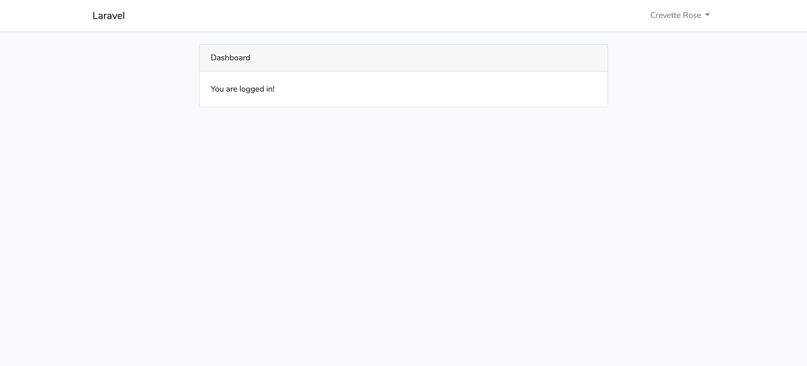
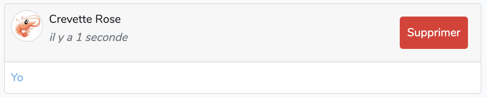
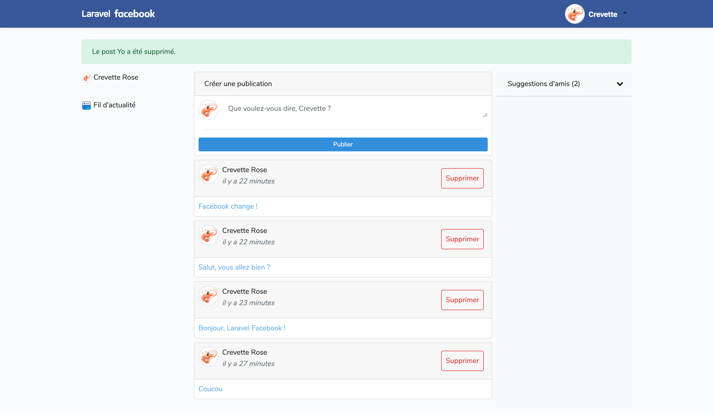

## IX. Création d'un post

### A. Création de la Migration/Table "Post"

-   Crée une migration pour effectuer des posts

```
php artisan make:migration create_posts_table
```

Son contenu initial est le suivant :

```php
<?php

use Illuminate\Database\Migrations\Migration;
use Illuminate\Database\Schema\Blueprint;
use Illuminate\Support\Facades\Schema;

class CreatePostsTable extends Migration
{
    /**
     * Run the migrations.
     *
     * @return void
     */
    public function up()
    {
        Schema::create('posts', function (Blueprint $table) {
            $table->id();
            $table->timestamps();
        });
    }

    /**
     * Reverse the migrations.
     *
     * @return void
     */
    public function down()
    {
        Schema::dropIfExists('posts');
    }
}

```

-   Modification du contenu pour faire correspondre nos posts à nos utilisateurs
    -   Ajout d'un champ "text"
    -   Ajout d'un champ faisant la liaison avec l'id de l'utilisateurs de la table "users".

```php
  $table->string('text');
  $table->integer('user_id')->unsigned();
```

-   Lancement de la migration

```
php artisan migrate
```

### B. Création du controller

-   Tout d'abord, nous créons notre controller avec les références qui vont bien

```
php artisan make:controller PostController -r
```

<p>
    On demande à LARAVEL de créer un controlleur pour gérer les données de la vue, le "-r" permet de créer ce fichier avec les ressources précharger (function index(), voir(), créer(), modifier(), supprimer() etc...)
</p>

-   Aperçu du controller précédemment crée :

<details>
<summary>Contenu PostController</summary>

```php
<?php

namespace App\Http\Controllers;

use Illuminate\Http\Request;
use Illuminate\Support\Facades\Auth;
use App\Post;
use App\User;

class PostController extends Controller
{
    /**
     * Display a listing of the resource.
     *
     * @return \Illuminate\Http\Response
     */
    public function index()
    {
        //
    }

    /**
     * Show the form for creating a new resource.
     *
     * @return \Illuminate\Http\Response
     */
    public function create()
    {
        //
    }

    /**
     * Store a newly created resource in storage.
     *
     * @param  \Illuminate\Http\Request  $request
     * @return \Illuminate\Http\Response
     */
    public function store(Request $request)
    {
        //
    }

    /**
     * Display the specified resource.
     *
     * @param  int  $id
     * @return \Illuminate\Http\Response
     */
    public function show($id)
    {
        //
    }

    /**
     * Show the form for editing the specified resource.
     *
     * @param  int  $id
     * @return \Illuminate\Http\Response
     */
    public function edit($id)
    {
        //
    }

    /**
     * Update the specified resource in storage.
     *
     * @param  \Illuminate\Http\Request  $request
     * @param  int  $id
     * @return \Illuminate\Http\Response
     */
    public function update(Request $request, $id)
    {
        //
    }

    /**
     * Remove the specified resource from storage.
     *
     * @param  int  $id
     * @return \Illuminate\Http\Response
     */
    public function destroy($id)
    {
        //
    }
}

```

</details>

### C. Création du Model

PS : Nous aurions pu crée les 3 fichier directement (Migration, Ressources, Controller) grâce à la commande suivante :

```
php artisan make:model Post -mrc
```

Vu que nous avons fait par étapes continuons, création du model :

```
php artisan make:model Post
```

Le model permet la liaison entre les différentes tables mais aussi de vérifier que la valeur correspond bien à ce que le champs demandent.

Nous avons donc besoin ici de rajouter la liaison entre nos posts et notre utilisateurs, pour cela écrire la fonction suivante dans notre model :

```php
    //Gestion de la liaison Many to Many
   public function user(){
        return $this->belongsTo(\App\User::class);
    }
```

Notre modèle est désormais prêt !

Revenons a notre controller...

### D. Gestion Vue/Controller/Route/

<p>
    Nous venons de crée notre migration, notre controller et notre model, désormais nous avons besoins de la vue, des routes associés, ainsi que les données gérer dans le controller précédemment crée.
</p>

Pour crée notre page (vue) qui accueillera nos posts, plusieurs solutions existent :

1. Crée la page nous même dans le dossiers "views" et appelé le à votre guise.
2. Utiliser la vue de page d'accueil existante ici : **_"home.blade.php."_**

Dans cet exemple, nous utiliserons la méthode 2, utilisation de la vue existante en la modifiant pour nos besoins.

-   Récapitulatif

1. Vue = **"home.blade.php"** qui reccueillera les données saisies par l'utlisateur
2. Controller = **"PostController"** qui contrôlera les données reccueillit et renverra la réponse
3. Route = **"web.php"** qui comportera les routes qui sont la liaison entre la vue et le controller

Dans ce projet, nous procéderons par étapes :

-   Gestion de la vue du fil d'actualité accueillant nos futurs posts
-   Création d'un post par l'utlisateur
-   Suppression d'un post crée par l'utlisateur

#### Étape 1 - &#128065; - Visibilité de la page

Fichier : "home.blade.php"

-   Il correspondait au visuel suivant :
    

1.  Modification de la vue

Nous allons modifier ce visuel pour que nous puissions poster des commentaires, les voir et les supprimer.

<details>
<summary>Code de la page</summary>

```php
@extends('layouts.app')
@section('title')
Laravel Facebook - Home
@endsection
@section('content')
<div class="container">
    <div class="row justify-content-center">
        <div class="col-md-12">
            @if(session()->has('ok'))
            <div class="alert alert-success alert-dismissible">{!! session('ok') !!}</div>
            @endif


            <div class="d-flex">
                <div class="" style="width:20%;">
                    <p class="">

                        avatar}}" alt=""
                            width="20"> {{Auth::user()->firstname}} {{Auth::user()->name}}
                    </p>
                    <div class="m-2">
                        <hr style="opacity:0;">
                    </div>
                    <p> Fil d'actualité</p>
                </div>
                <div class="mx-2" style="width:55%;">
                    <div class="card">
                        <div class="card-header">Créer une publication</div>
                        <div class="card-body p-0">
                            @if ($errors->any())
                            <div class="alert alert-danger">
                                <ul>
                                    @foreach ($errors->all() as $error)
                                    <li>{{ $error }}</li>
                                    @endforeach
                                </ul>
                            </div>
                            @endif
                            <div class="form-group m-2 ">
                                <form method="post" action="{{route('create.post')}}">
                                    <input type="hidden" name="user_id" value="{{ Auth::user()->id }}">
                                    <div class="d-flex">
                                        <div class="mr-2">avatar}}" alt="" width="40"></div>
                                        <textarea name="text"
                                            class="form-control @error('text') is-invalid @enderror mb-2 border-0"
                                            placeholder="Que voulez-vous dire, {{Auth::user()->firstname}} ?" id="text"
                                            rows="1">{{ old('text') }}</textarea>
                                    </div>
                                    {{csrf_field()}}
                                    <div class="m-2">
                                        <hr>
                                    </div>
                                    <button href="#" class="btn btn-primary btn-sm btn-block" role="button"
                                        aria-pressed="true" type="submit">Publier</button>
                                </form>
                            </div>
                        </div>
                    </div>

                    <!-- Fil d'actualité -->
                    @if(!$posts)
                    <div class="card mt-2">
                        <div class="card-header">Fil d'actualité</div>
                        <div class="card-body">Aucune publication</div>
                    </div>
                    @else
                    @foreach ($posts as $post)
                    @csrf
                    <div class="card mt-2">
                        <div class="card-header d-flex my-auto p-2">
                            <div class="mr-2">user->getAvatar()}}" alt="" width="40"></div>
                            <div class="mr-auto">
                                <p class="my-auto">{{$post->user->firstname}} {{$post->user->name}}</p>
                                <p class="text-muted mr-2 my-auto text-secondary font-italic">
                                    {{$post->created_at->locale('fr_FR')->diffForHumans()}}</p>
                            </div>
                            <form action="{{route('destroy.post', $post->id)}}" method="DELETE" id="myform" class="p-2">
                                @if ($post->user->id === Auth::user()->id)
                                <button type="submit" class="btn btn-outline-danger p-2" onclick="if(confirm('Voulez-vous vraiment supprimer ce post ?')){
                                                return true;}else{ return false;}">Supprimer</button>
                                @endif
                            </form>
                        </div>
                        <div class="card-body outer p-2">
                            <p class="m-0 text-info">
                                {{$post->text }}
                            </p>

                        </div>

                    </div>
                    @endforeach
                    @endif
                    {{$posts->links()}}
                </div>

                <!-- Suggestions d'amis -->
                <div class="card border-0 bg-light" style="width:25%;">
                    <div class="navbar px-0 bg-light" style="
    border-bottom: 1px solid lightgrey;">
                        <h6 class=" mt-2 pl-4">Suggestions d'amis ({{$users->count()-1}})
                        </h6>
                        <button class="navbar-toggler" type="button" data-toggle="collapse"
                            data-target="#navbarSupportedContent" aria-controls="navbarSupportedContent"
                            aria-expanded="false" aria-label="Toggle navigation">
                            <svg width="20" height="20" aria-hidden="true" focusable="false" data-prefix="fas"
                                data-icon="angle-down" class="svg-inline--fa fa-angle-down fa-w-10" role="img"
                                xmlns="http://www.w3.org/2000/svg" viewBox="0 0 320 512">
                                <path fill="currentColor"
                                    d="M143 352.3L7 216.3c-9.4-9.4-9.4-24.6 0-33.9l22.6-22.6c9.4-9.4 24.6-9.4 33.9 0l96.4 96.4 96.4-96.4c9.4-9.4 24.6-9.4 33.9 0l22.6 22.6c9.4 9.4 9.4 24.6 0 33.9l-136 136c-9.2 9.4-24.4 9.4-33.8 0z">
                                </path>
                            </svg>
                        </button>
                        <div class="collapse navbar-collapse bg-white p-2" id="navbarSupportedContent">
                            <div class="content">
                                @foreach ($users as $user)
                                @if ($user != Auth::user())
                                <div class="card-body d-flex p-0 pb-2">
                                    <a href="{{ route('profil', $user->id) }}" class="my-auto mr-auto"
                                        style="text-decoration: none; color: inherit;">
                                        <div class="d-flex">
                                            avatar}}" alt="" width="40">
                                            <p class="p-2 my-auto">{{$user->firstname}}</p>
                                            <p class="my-auto">{{$user->name}}</p>
                                        </div>
                                    </a>
                                    <div class=" my-auto">
                                        @if($users == true)
                                        <a href="" class="btn btn-primary btn-sm" role="button"
                                            aria-pressed="true">Ajouter</a>
                                        @endif
                                    </div>
                                </div>
                                @endif
                                @endforeach
                            </div>
                        </div>
                    </div>
                </div>


            </div>


        </div>
    </div>
</div>
@endsection

```

</details>

#### Étape 1 - &#128065; - Controller gérant la vue de la page

-   Création de la fonction index :

```php
 public function index(Post $post, User $user)
    {
        //Post de tout le monde
        //$posts = $post->orderBy('id', 'DESC')->where('user_id', Auth::user()->id)->paginate(4);

        //Post de la personne connecté
        $posts = $post
        ->orWhere('user_id', Auth::user()->id)
        ->with('user')
        ->orderBy('id', 'DESC')
        ->paginate(4);

        //Récupère tous les users
        $users = $user->orderBy('id', 'DESC')->get();

        //Retourne la view des posts
        return view('home', ['posts' => $posts ,  'users' => $users]);
    }
```

Ajout des références utilisés :

```php
use App\Post;
use App\User;
```

#### Étape 1 - &#128065; - Route faisant la liaison entre la vue et le controller de la page

-   Ajouter la ligne suivante pour que la liaison entre votre vue et votre controller se fassent

```php
//Route::get('/home', 'HomeController@index')->name('home');
//Route de vision de la page de fil d'actualité
Route::get('/home', 'PostController@index')->name('home');
```

-   N'oublier pas de commenter la ligne qui correspondait à la liaison entre le controller (HomeController) et la vue (home.blade.php) de base de LARAVEL c'est-à-dire :

```php
// Ce symbole permet de commenter le code "//"
Route::get('/home', 'HomeController@index')->name('home');
```

Car nous avons modifié la vue pour qu'elle coresponde à nos attentes et pour cela, nous lui avons crée un nouveau controller qui nous est propre appelé "PostController".

#### Étape 1 - &#128065; - Rendu visuel initial


#### Étape 2 - &#128172; - Vue, partie création d'un post

-   Partie non visible qui accueillera les posts.
    Nous l'avons déjà mis dans l'étape 1, ceci est un rappel pour vous montrez les différentes parties.

```php
   <!-- Fil d'actualité -->
                    @if(!$posts)
                    <div class="card mt-2">
                        <div class="card-header">Fil d'actualité</div>
                        <div class="card-body">Aucune publication</div>
                    </div>
                    @else
                    @foreach ($posts as $post)
                    @csrf
                    <div class="card mt-2">
                        <div class="card-header d-flex my-auto p-2">
                            <div class="mr-2">user->getAvatar()}}" alt="" width="40"></div>
                            <div class="mr-auto">
                                <p class="my-auto">{{$post->user->firstname}} {{$post->user->name}}</p>
                                <p class="text-muted mr-2 my-auto text-secondary font-italic">
                                    {{$post->created_at->locale('fr_FR')->diffForHumans()}}</p>
                            </div>
                            <form action="{{route('destroy.post', $post->id)}}" method="DELETE" id="myform" class="p-2">
                                @if ($post->user->id === Auth::user()->id)
                                <button type="submit" class="btn btn-outline-danger p-2" onclick="if(confirm('Voulez-vous vraiment supprimer ce post ?')){
                                                return true;}else{ return false;}">Supprimer</button>
                                @endif
                            </form>
                        </div>
                        <div class="card-body outer p-2">
                            <p class="m-0 text-info">
                                {{$post->text }}
                            </p>

                        </div>

                    </div>
                    @endforeach
                    @endif
                    {{$posts->links()}}
```

#### Étape 2 - &#128172; - Controller gérant la création

-   Création de la fonction create :

```php
use Illuminate\Http\Request;
 public function create(Post $post, Request $request)
    {
        //Validation
        $validate = $request->validate([
            'text' => 'required',
        ]);
        //Création
        $post = new Post;
        $post->text = $request->text;
        $post->user_id = $request->user_id;

        //Sauvegarde du post tweet
        $post->save();

        //Redirection sur la dernière page visité
         return redirect::back();
    }
```

#### Étape 2 - &#128172; - Route de liaison

-   Ajouter la ligne suivante pour que la liaison entre votre fonction de creation (controller) et votre vue se fassent :

```php
//Route de la méthode post un commentaire (création)
Route::post('/home', 'PostController@create')->middleware('auth')->name('create.post');
```

#### Étape 2 - &#128172; - Rendu visuel avec publication


#### Étape 3 - &#9940; - Vue, partie suppression d'un post

-   Partie formulaire de suppression.
    Nous l'avons déjà mis dans l'étape 1, ceci est un rappel pour vous montrez les différentes parties.

```php
<form action="{{route('destroy.post', $post->id)}}" method="DELETE" id="myform" class="p-2">
    @if ($post->user->id === Auth::user()->id)
    <button type="submit" class="btn btn-outline-danger p-2" onclick="if(confirm('Voulez-vous vraiment supprimer ce post ?')){
                    return true;}else{ return false;}">Supprimer</button>
    @endif
</form>
```

#### Étape 3 - &#9940; - Controller gérant la suppression

-   Création de la fonction destroy :

```php
  public function destroy($id, Post $post)
    {
        //Trouve le post de l'utilisateur concerné
        $p = $post->find($id);
        //Si t'es authentifier alors il supprime
       if (Auth::check()) {
        $p->delete($id);

        //
        return redirect::back()->withOk("Le post " . $p->text . " a été supprimé.");
        }
    }
```

-   Ajout des références suivantes :

```php
use Illuminate\Support\Facades\Auth;
use Illuminate\Support\Facades\Redirect;
```

#### Étape 3 - &#9940; - Route de liaison

-   Ajouter la ligne suivante pour que la liaison entre votre fonction de destroy (controller) et votre vue se fassent :

```php
//Route de la méthode delete un post (suppression)
Route::get('/home/{id}', 'PostController@destroy')->middleware('auth')->name('destroy.post');
```

#### Étape 3 - &#9940; - Rendu visuel suppression publication





