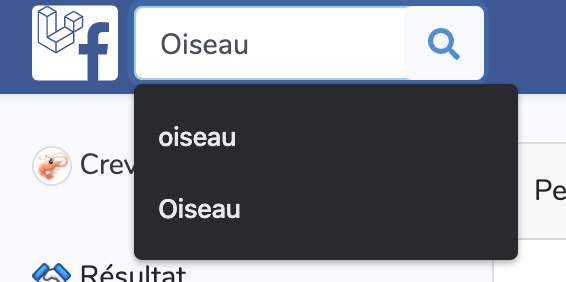
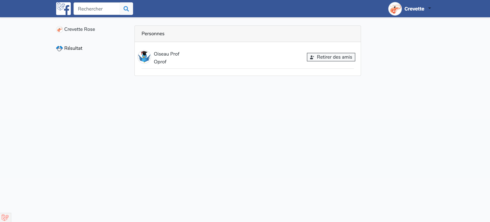
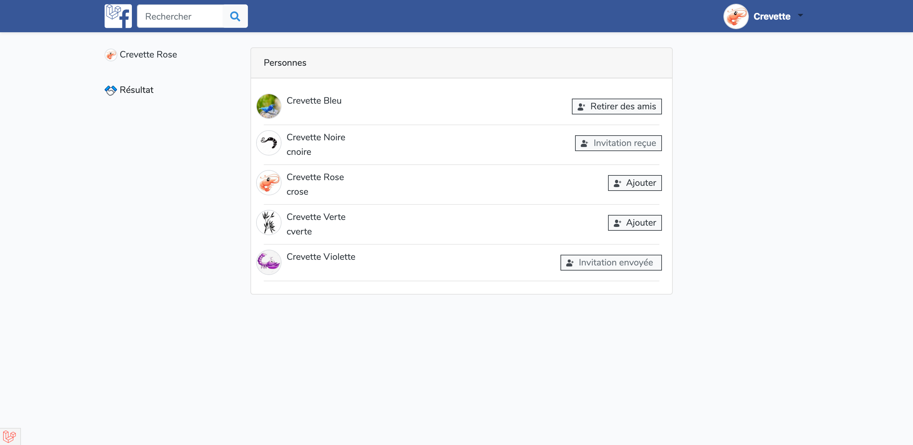

## Barre de Recherche, Petit Logo & Favicon

Rechercher un utilisateurs dans la barre de recherche

### A. Création de la barre de recherche 

- La barre de recherche se trouve sur toutes les pages de notre application dans notre barre de navigation.

Celle-ci se trouve dans notre fichier _**"app.blade.php"**_. Nous allons donc encore modifier ce fichier pour y ajouter celle-ci et aussi changer notre logo au besoin ou autres...

1. Formulaire à ajouter pour crée la barre de recherche
```php
<form class="form-inline position-relative w-100" action="{{ url('search') }}" method="GET">
    <input class="form-control mr-sm-2" type="search" placeholder="Rechercher"
        aria-label="Search" name="search" class="form-control @error('search') is-invalid @enderror">
    <button class="btn btn-outline-primary" type="submit"><svg class="svg-search" width="16"
            height="16" xmlns="http://www.w3.org/2000/svg" viewBox="0 0 512 512">
            <path
                d="M505 442.7L405.3 343c-4.5-4.5-10.6-7-17-7H372c27.6-35.3 44-79.7 44-128C416 93.1 322.9 0 208 0S0 93.1 0 208s93.1 208 208 208c48.3 0 92.7-16.4 128-44v16.3c0 6.4 2.5 12.5 7 17l99.7 99.7c9.4 9.4 24.6 9.4 33.9 0l28.3-28.3c9.4-9.4 9.4-24.6.1-34zM208 336c-70.7 0-128-57.2-128-128 0-70.7 57.2-128 128-128 70.7 0 128 57.2 128 128 0 70.7-57.2 128-128 128z" />
        </svg></button>
</form>
```

Personnellement je l'ai ajouter dans la barre de navigation dans le `<ul>` suivant :
```php
 <!-- Left Side Of Navbar -->
<ul class="navbar-nav mr-auto pl-2">
</ul>
```
### B. Création du controller
-   Tout d'abord, nous créons notre controller sans les références car nous allons juste faire un affichage

```
php artisan make:controller SearchController
```

1. Voici le controller crée :
```php
<?php

namespace App\Http\Controllers;

use Illuminate\Http\Request;

class SearchController extends Controller
{
    //
}
```

2. Ajouter la fonction de récupération des données recherchés
```php
    public function index(User $user)
    {
        $search = \Request::get('search');  

        $users = User::where('name','LIKE','%'.$search.'%')
        ->orWhere('firstname','LIKE','%'.$search.'%')
        ->orWhere('pseudo','LIKE','%'.$search.'%')
            ->orderBy('name')
            ->paginate(10);
    //dd($users);
    //dd($search);

        return view('search',compact('users'))->withuser($user);
    }
```

### C. Création de la vue
- La vue accueillera les résultats de la recherche.
Dans le dossier de views, crée le fichier _**"search.blade.php"**_

1. Récupérer le template de notre application
```php
<!--Récupération du template "lajouts.app" qui corespond au fichier "app.blade.php" -->
@extends('layouts.app')

@section('title')
<!--Ici insérer votre titre d'onglet de page -->
Laravel Facebook - Recherche
@endsection

@section('style')
<!--Ici insérer votre style CSS propre à la page -->
@endsection
@section('content')
<!--Ici insérer votre contenu de recherche -->
@endsection
```

2. Ajouter le contenu de notre recherche
<details>
<summary>Voir le code stylisé</summary>

```php
<div class="container">
    <div class="row justify-content-center">
        <div class="col-md-12">
            @if(session()->has('ok'))
            <div class="alert alert-success alert-dismissible">{!! session('ok') !!}</div>
            @endif

            <div class="d-flex">
                <div class="" style="width:20%;">
                    <a href="{{ route('profil', Auth::user()->id) }}" class="text-decoration-none text-dark m-auto">
                        <p class="">
                            avatar}}"
                                alt="" width="20"> {{Auth::user()->firstname}} {{Auth::user()->name}}
                        </p>
                    </a>
                    <div class="m-2">
                        <hr style="opacity:0;">
                    </div>
                    <p> Résultat</p>
                </div>
                <div class="mx-2" style="width:60%;">
                    <div class="card">
                        <div class="card-header">Personnes</div>
                        <div class="card-body p-2 my-2">
                            @if ($errors->any())
                            <div class="alert alert-danger">
                                <ul>
                                    @foreach ($errors->all() as $error)
                                    <li>{{ $error }}</li>
                                    @endforeach
                                </ul>
                            </div>
                            @endif
                            @if(!$users->isEmpty())
                            @foreach($users as $user)

                            <div class="d-flex my-2">
                                <a href="{{ route('profil', $user->id) }}" class="text-decoration-none text-dark">
                                    <div class="mr-2">getAvatar()}}" alt="" width="40">
                                    </div>
                                </a>
                                <a href="{{ route('profil', $user->id) }}" class="text-decoration-none text-dark">
                                    <p class="my-auto">{{$user->firstname}} {{$user->name}}</p>
                                    <p class="my-auto">{{$user->pseudo}}</p>
                                </a>
                                <div class="p-2 ml-auto">
                                    @switch(Auth::user())
                                    @case ($user->isFriend(Auth::user()) == 0 &&
                                    Auth::user()->demandeAmis($user) == 1 &&
                                    Auth::user()->demandeRecu($user) == 1)
                                    <a class="text-decoration-none text-dark"
                                        href="{{ route('profil.amisAdd', $user->id)}}" role="button"
                                        aria-pressed="true">
                                        <div class="border border-dark">
                                            <div class="bg-light d-flex m-auto">
                                                <div class="ml-2">
                                                    
                                                </div>
                                                <p class="my-auto mx-2">Ajouter</p>
                                            </div>
                                        </div>
                                    </a>
                                    @break
                                    @case (Auth::user()->demandeAmis($user) == 1)
                                    <div class="border border-dark" style="width:160px;">
                                        <div class="bg-light d-flex m-auto">
                                            <div class="ml-2">
                                                
                                            </div>
                                            <p class="my-auto mx-2 text-secondary">Invitation envoyée
                                            </p>
                                        </div>
                                    </div>
                                    @break
                                    @case (Auth::user()->demandeRecu($user) == 1)
                                    <div class="border border-dark">
                                        <div class="bg-light d-flex m-auto">
                                            <div class="ml-2">
                                                
                                            </div>
                                            <p class="my-auto mx-2 text-secondary">Invitation reçue</p>
                                        </div>
                                    </div>
                                    @break
                                    @case (Auth::user()->isFriend($user) == 1)
                                    <a class="text-decoration-none text-dark"
                                        href="{{ route('profil.amisDelete', $user->id)}}" role="button"
                                        aria-pressed="true">
                                        <div class="border border-dark">
                                            <div class="bg-light d-flex m-auto">
                                                <div class="ml-2">
                                                    
                                                </div>
                                                <p class="my-auto mx-2">Retirer des amis</p>
                                            </div>
                                        </div>
                                    </a>
                                    @break
                                    @default
                                    <a class="text-decoration-none text-dark"
                                        href="{{ route('profil.amisAdd', $user->id)}}" role="button"
                                        aria-pressed="true">
                                        <div class="border border-dark">
                                            <div class="bg-light d-flex m-auto">
                                                <div class="ml-2">
                                                    
                                                </div>
                                                <p class="my-auto mx-2">Ajouter</p>
                                            </div>
                                        </div>
                                    </a>
                                    @break
                                    @endswitch
                                </div>
                            </div>
                            <div class="mx-2">
                                <hr class="m-1 p-0">
                            </div>

                            @endforeach
                            @else
                            <div class="d-flex my-2">
                                Aucun résultat corespondant
                            </div>
                            @endif
                        </div>
                    </div>

                </div>

            </div>
        </div>
    </div>
```
</details>

Données essentiels non stylisé
```php
<!--Si user = pas vide -->
   @if(!$users->isEmpty())
   <!--Boucle d'affichage des Users trouvés -->
    @foreach($users as $user)

   getAvatar()}}" alt="" width="40">
    <p class="my-auto">{{$user->firstname}} {{$user->name}}</p>
    <p class="my-auto">{{$user->pseudo}}</p>
    <a href="{{ route('profil', $user->id) }}" class="text-decoration-none text-dark">Voir le profil</a>
    <!--Fin de la boucle -->   
    @endforeach
     <!--Sinon user = vide -->
    @else
    <div>
        Aucun résultat corespondant
    </div>
     <!--Fin de la condition -->
    @endif
```

### D. Création de la route

Ajouter la ligne suivante dans "web.php"
```php
Route::get('/search', 'SearchController@index')->name('search');
 ```

### E. Rendu visuel
Vous pouvez rechercher des utilisateurs via leurs noms, prénoms et pseudo

1. Barre de recherche
  

2. Recherche avec données non valide
  

3. Recherche avec le pseudo
  

4. Recherche avec le prénom
  

## Petit Logo

Changement du grand logo par le petit logo après connexion
```php
  <a class="navbar-brand p-0 m-0" href="{{ url('home') }}">
        
    </a>
```

## Favicon

Ajouter la ligne suivante pour mettre une image dans l'onglet de votre navigateur, bien sûre le lien "href" de l'image doit correspondre à l'endroit ou vous avez stocker votre image.

```html
<link rel="shortcut icon" type="image/png" href="/img/logo-laravel-facebook.svg" />
```